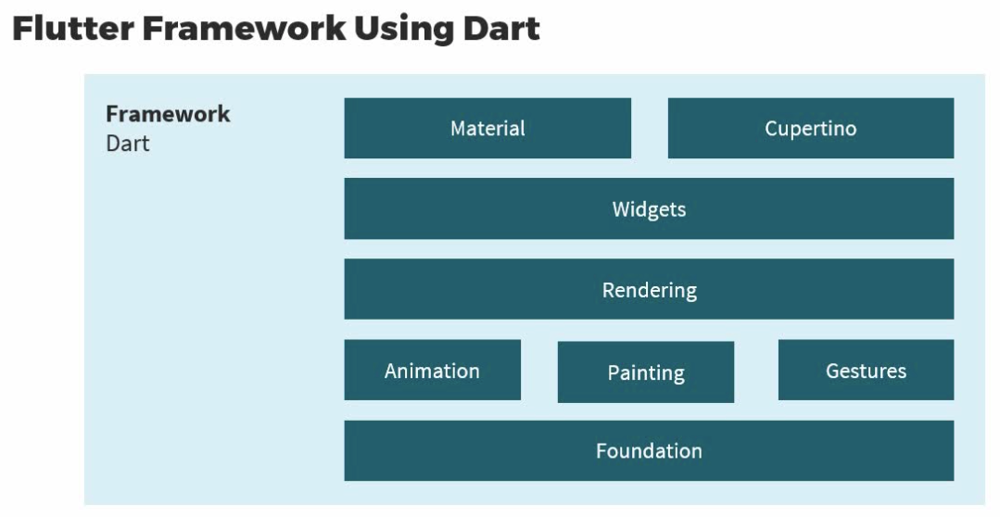
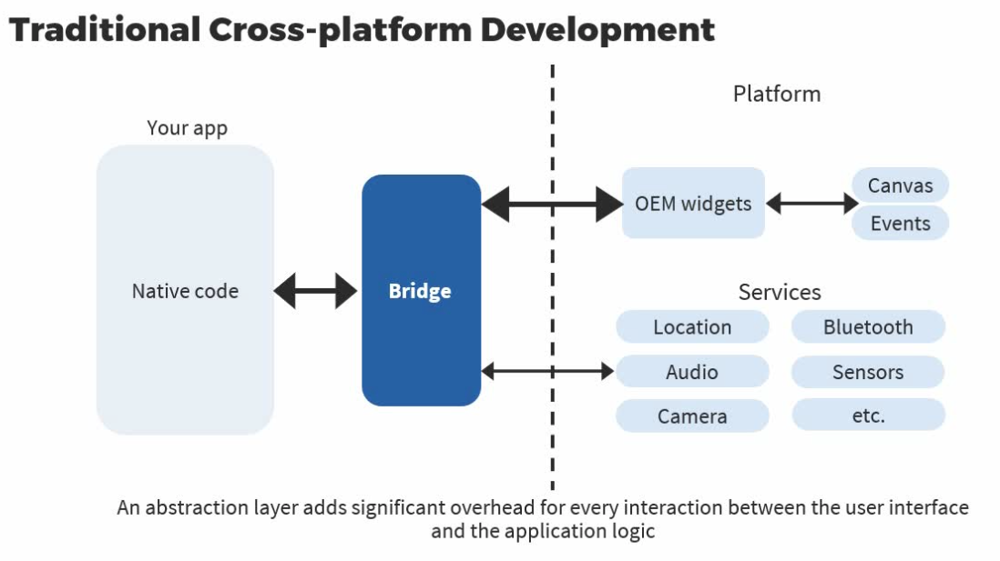

# Layouts in Flutter

## Widget in Flutter

When you use Flutter to build cross-platform applications,everything that you represent in the user interface,every UI component is a widget. we'll discuss how we can use widgets in Flutter.Now, The Flutter framework is composed of layers,and each layer is built on top of the layer just below it.It only uses abstractions from the layer below.The layer at the very bottom, the Embedder, is a platform-specific layer that changes based on whether we're running our Flutter app on iOS or Android.The Flutter Engine is responsible for all of the rendering primitives and other primitives in Flutter then, we have the Flutter framework at the very top.The Flutter framework uses the Dart programming language,and this is what we're going to interact with as a developer of Flutter applications.

The Flutter framework gives us everything that we need to build beautiful responsive apps.We have animation, painting, gestures.On top of that, there's a rendering layer.Widgets lie on top of the rendering layer, so widgets are rendered to screen and there are two broad flavors of the widget library that we're likely to use.If we're building an Android app,we'll use widgets that belong to the Material design library.If we're building an iOS app, we'll use widgets from the Cupertino library.The reactive user interfaces that we build with Flutter are build using a pseudo-declarative framework. This pseudo-declarative framework uses composition to build upa hierarchy of components that we visualize on the user interface. Now, these components might be immutable or they may have some internal state.Flutter ensures that the application state associated with the components explicitly decoupled from the interface state.And it's our responsibility as a developer to provide a mapping between the application state and the interface state.

Flutter UI components are set up in such a way that once we change the application state of a component,the framework is responsible for updating the interface.The framework takes care of the runtime and cascading updates to all of the UI elements that change because of the change in application state. Every user interface component in Flutter is a widget. A widget can be thought of as an immutable class used to configure a tree of objects,and this tree of objects represents our entire user interface. Widgets are a unit of composition and complex widget hierarchies can be used to build the layouts for our apps. If we have a complex UI layout that's built using a widget tree,we have a root widget,and then multiple widgets composed within that root widget and we'll see the structure even from the very first Flutter app that we build. 

Every widget nests inside a parent widget and can receive context from the parent widget all the way up to the root widget.So, we get this tree of widgets. Each widget can receive context and other information from the parent. Here is what a basic structure for a simple widget might look like.

This custom widget is called MyStore,and it extends the StatelessWidget based class.The fact that it extends StatelessWidget means that this widget inherently does not have any mutable state.That is, the configuration and look and feel of this widget does not change over the life cycle of this widget. Now, every StatelessWidget provides an implementation for the build method. Note that the build method accepts a BuildContext as an input argument and returns a Widget.The build method is the function that is responsible for converting whatever state we have within a widget to user interface.For a StatelessWidget, it just means converting whatever configuration the widget has received when it is first created,and representing that configuration as a user interface component that the user can then interact with and view.When we're using an app and we're navigating through the pages of the app,it's possible that the build method is invoked over and over again,which is why this method should be fast to execute and free of side-effects because it may be called many times by the Flutter framework. The representation of the MyStore custom widget is actually a widget tree. Observe within the build method, we build up a tree of composable widgets. We have MaterialApp at the root and then a Scaffold inside it and then a Center, then a Text, and a TextStyle. All of these are widgets in Flutter and these widgets compose one within another to build up a widget tree,that is then rendered onto screen.Now, as we're using our mobile application, it's quite likely that we do something to change the user interface,so apps update the user interface in response to events.Now, these updates usually involve replacing a widget in the widget tree,that is the hierarchy, with another widget.Now, we don't have to worry about which widget needs to be updated or how we can update widgets.It's the framework's responsibility to compare the old widgets and the new widgets that make up our widget tree and efficiently update the user interface because Flutter is a cross-platform application,it does not rely on native UI elements.So, Flutter implements its own UI controls.Controls are not dependent on controls provided either by the Android or iOS platforms.Controls are completely decoupled from system dependencies.The fact that Flutter implements its own controls means that we use the same controls whether we're developing for Android or iOS and this also provides unlimited extensibility. 

Any extension created by a third-party developer can be used on all platforms. Developers are not limited by what a particular platform has to offer another significant advantage of Flutter's implementation, great performance. Flutter implementing its own UI control greatly improves performance by allowing Flutter to composite the entire scene at once without transitioning between Flutter code and platform code.Everything we build and display in Flutter is a widget,and widgets are built using composition. Widgets are composed of many other single-purpose widgets that combine to produce powerful effects.As we're building layouts in Flutter, we'll find ourself constantly referencing the docs to find the right widget to use. we'll find that there are a large number of widgets. Class hierarchy in Flutter is shallow and broad.The focus is on having small, composable widgets that do exactly one thing well. No widget tries to do too many things at one go. Basic features such as padding, alignment,what we might think of as properties of a widget are widgets by themselves. When we're building our own custom widgets in Flutter,we very rarely have to inherit from other widget classes.Customizing widgets involves composing it into other widgets rather than subclassing widgets.

So, what do we do when we create our own custom widget? Remember that the visual representation of a widget,what exactly the widget looks like,is specified by overriding the build() method, which returns a widget tree.Every invocation of the build method in Flutter will return a new tree of widgets.The Flutter framework then determines which widgets have changed and which need to be re-rendered. That's not the developer's responsibility.Flutter can then recreate only those parts of the user interface,where the state has changed and the corresponding widget has changed.Widgets in Flutter can be divided into two broad categories. 
## Stateless Widgets
Stateless widgets contain no mutable state.They contain no properties that change over time. Stateless widgets do not change their look and feel over the lifetime of the app.They're easy to understand
## Stateful widgets
Stateful widgets, contain mutable properties that change over the lifetime of the widget.

Let's look at stateful widgets in a little more detail. Now, we might interact with our app and user interactions and other events can change the state of a particular widget in our app. Let's say, we click on something, we might select or deselect that widget,that's a change of state.When the state changes,the widget user interface needs to be updated to reflect this change of state. Now, Flutter does this really cool thing to ensure that you work with stateful and stateless widgets in the same way. Stateful widgets are actually immutable. The widget itself is immutable. State is held in a separate object. So, the state of a widget is actually a completely separate object. It's not the widget itself that holds state. This makes programming with widgets very easy. Other widgets can treat stateful and stateless widgets the same way. They don't have to know what type of widget they're dealing with also, widgets need not hold onto the state,the framework will find and reuse the state as needed. This basically frees the widget from responsibility to keep track of the state.

As a developer in Flutter, we'll write code to create custom widgets.Each widget is essentially a widget tree.A custom widget is made-up of composing other widgets. we'll discuss how these widgets are rendered to screen,rendering and layout in Flutter. This requires us to step back and understand what Flutter really is. It's a cross-platform framework that offers comparable performance to native frameworks.
This last part is important. How does Flutter offer comparable performance to native Android and iOS frameworks? Every platform, that is every operating system,offers a slew of widgets and other services that frameworks can use. Traditional cross-platform frameworks create an abstraction layer over the underlying native Android and iOS libraries.So, they use a bridge to communicate with the underlying platform widgets and services and display their app.As we might imagine, this abstraction layer adds a significant over head for every interaction between the user interface and the application logic.This is why traditional cross-platform frameworks haven't been very fast or performant.Flutter is different.

The Flutter platform does not use an abstraction layer at all.Flutter implements its own UI controls,uses its own widget set that uses the Skia Graphics Engine on Android,which is written in C++, and this is what renders Flutter widgets to the screen.This Skia Engine is not part of the underlying platform.Flutter embeds its own copy of the Skia Engine,so application upgrades can get the latest performance even if the underlying platform has not been upgraded, this is a big deal.Now, Flutter functions the same way on other native platforms as well.iOS, Windows, macOS.

Let's now look at a very short snippet of code that represents a widget hierarchy.We have a Container with some properties that is color, color set to blue.It has a child which is a Row.The Row widget has two children, an Image widget and a Text widget.Let's assume that this is what your custom widget looks like.You would specify this hierarchy in the build method of your custom widget.Widgets are nested one within another using composition,and this leads to the buildup of a widget tree.Take a note of this widget tree.We have the container widget at the very root of the tree.And at the leaves of the tree, we have the RawImage and RichText widgets,which are responsible for rendering the image and text to screen.Observe that there is an additional widget here.This ColoredBox wasn't a widget that we had specified in our tree.This is an additional widget that Flutter has introduced.Because we set the color property on the container,this actually introduces a ColoredBox in the widget hierarchy.And Flutter does this automatically behind the scenes.Now, in our hierarchy,we had specified that an Image and a Text has to be rendered.This requires the insertion of additional widgets in the hierarchy.Image and Text widgets may introduce child widgets during the build process.Again, this is something that you're abstracted from.The widget tree is something that you specify in the build method.During the build phase for your user interface,widgets expressed in code are translated to something known as an element tree.There is typically one element for every widget in the original widget tree,and each element represents an instance of the widget in the tree hierarchy.Remember, you have nothing to do with the element tree,a Flutter creates that for you.Now, there are two types of elements.The ComponentElement typically serves as a container or host for other elements.It just holds other elements within it.And then, you have the RenderObjectElement,which actually participates in the layoutor paint phases of your user interface.Think of the RenderObjectElementas an element that has a physical representation in your screen.Now, here is our mapping from the widget tree to the element treefor the very simple widget that we had set up earlier.Observe that every widget in our widget treemaps to a corresponding element in the element tree.And the elements are of two types, ComponentElement and RenderObjectElement.You can see that the Container, Image, and Text widgets are ComponentElements.They act as a host or they hold other elements within them.On the other hand, the ColoredBox, Row, RawImage, and RichText widgetsare all mapped to RenderObjectElements.RenderObjectElements have a physical representationor a layout in the user interface.The question now is why does Flutter have these two separate trees?Why does it have the widget tree and the element tree?Turns out the answer is performance.The Element tree is a persistent tree that persists from one frameto another in your Flutter app,so it plays a very critical role in how your app performs.Because the Element tree is persistent,the Flutter framework can behave as though your widget hierarchyis entirely disposable.Flutter, basically, acts like the widget hierarchy is disposablewhile caching the underlying element representation.Each time you have to rebuild your widget tree,what Flutter does is just rebuild parts of the user interfaceby walking through the widgets that have changed.The widgets that have not changed are preservedbecause their element representationis available with Flutter behind the scenes.Remember that the element tree is made-up of ComponentElementsand RenderObjectElements.The RenderObjectElements in your element tree map to aRenderObject in another tree, known as the render tree.And this render tree is what Flutter uses for layoutand rendering of your UI components.The RenderObject is the abstract modelthat Flutter uses for layout and painting.Now, every RenderObject knows its parent,but it knows very little about its children.What a RenderObject does know is how to visit its childrenand what constraints the children have.So, you should know while laying out your UI components,there are three trees involved.As a developer, you build the widget tree,that is then converted to an element tree by the Flutter framework.The element tree is persistent across frames and the renderable elements.All of the RenderObjectElements in the element tree mapto a RenderObject in the render tree.Essentially, we have a separation of the element and RenderObject trees.How does this help?This helps with performance.When the layout of your app changes,only the relevant parts of the layout tree need to be walked and rebuilt.Having two separate trees also helps with clarity.This gives clearer separation of protocolsand allows each protocol to be specialized to their specific needs.The element tree can specialize to persisting the elements across frames.And the render tree can focus on rendering to screen.And finally, this separation helps with type safety.The render object tree can be more type safesince it guarantees at runtime that its children are of the right type.

Hi and welcome to this very first demo in this learning path,where we'll get set up with the Android Studio projectthat we'll use to iteratively build our applicationtill we get to a fairly functional app at the very end of this learning path.Now, I'm going to bring up Android Studio on my Mac machine.You may have it installed on your Windows machine.That's totally fine. There should be no difference.In the previous learning path,I've assumed that you've installed and set up the Android Studiointegrated development environment that we'll use for Flutter applications.Now, I have no new projects at this point in time.I'm first going to ensure that I have the Dart plugin.The Flutter framework uses the Dart programming language.And it's important that your Android Studio IDE has the Dart plugininstalled and configured for use.So, you get syntax highlighting, autocomplete,and all of the other features that you need to write code simply.On the left, you can see that I have the Dart plugin installed,and I also have the Flutter SDK installed from flutter.dev.This means I'm all set up for developing Flutter applications.I'll now head back to the Projects tab in order to create a brand-new project.This is the same project that we'll use for the entire learning path.We'll just build different applications within the same project.Click on the New Flutter Project option here.This will bring up a dialogthat will walk you through the creation of a project.You can see that Android Studio knows where my Flutter SDK has been installed.It's in /Users/loonycorn/flutter.On the next page, I'm going to specify where exactlyon my local machine this project is to be located.I click on the three dots here next to Project location,and I'm going to head into the folder that should hold my project.Make sure you place your project where you want it to be,so that you can access the contents of that project later.You can see that my project is under/Users/loonycorn/Projects/Skillsoft/Flutter.Now, I'm going to give this project a nameand since I'm going to be building a store application,I'll call this project insta_store.Somewhere in the middle of this dialog,you should be able to see the Platforms for whichyou want this project to be enabled.This will allow you to test on these platforms.I've chosen to test on Android, iOS, and Web applications.I can enable iOS as a platform because I'm running on a macOS machine.If you happen to be on a Windows machine,you won't be able to test using the iOS simulator.Just something to keep in mind, but really that's a very minor detail.Most of the demos, in fact, 95% of the demosjust run on the Android platform in this learning path.Click on the Finish button and this new project will be created for you.This is the project that we'll use to write our code.On the left-hand side, you can see the various folders that have been created.These are the folders and files that set upthe basic template of a Flutter project.The very first file that we'll take a look atin this project is our pubspec.yaml.As you might already know,the pubspec.yaml file is basically the configuration file for your project.This is where you specify your dependenciesand other metadata related to your app.You can see that the name of the project is insta_store.The description is by default A new Flutter project.I don't plan to publish this project to any package repository,that's why publish_to is none.On line 20, you can see that the default version for this project is 1.0.0.Scrolling further down, you can see the environment that this project uses.The sdk here refers to the Dart SDK.Make sure you're using a recent version of Dart,a version greater than 2.18.0 and less than 3.0.0.Under dependencies on line 31, you can see that we depend on the flutter sdk.Well, that's what we're going to use to build the Flutter app.And we depend on cupertino_icons.These are the icons that we'll use for iOS development.The dev_dependencies sectionis where you specify dependencies for the test that you run.You can see that our test also depend on the flutter sdk.And then, we have a linter process.And if you scroll further down, you'll find that in the flutter section,we have set uses-material-design to true.Material design as the comment says on lines 57 through 59,ensures that Material Icons font is included in our application,so that we can use the right fonts for our material design apps.Material design is a key approach to the Android platformfor both user interfaces and user interface design.It's developed by Google.And it's intended to facilitate a consistent user experience on the platform,so you can develop Android applications that have a consistent look and feel.So, if you're working in Flutter,make sure uses-material-design is always set to true.It's very rare that you're going to want this property to be set to false.Now, let's take a look at the devices on which we can run our app.If you look at the drop-down at the top,you can see that we can run our app on Chrome,on macOS, and using the iOS simulator.On the Windows machine, these options are likely to be a little different,but that's totally fine.Make sure you have an optionto be able to run your app on the Chrome (web) browser.We'll be using that.And now, I'm going to be setting up an Android virtual device,so you can test your apps on the Android emulator.Configuring a new virtual device on Android Studio is very straightforward.Head over to this Device Manager, click on the icon,and that will bring up the Device Manager, and click on the button herethat allows you to create a virtual device.This is what you'll also use when you connect physical devices to your machinein order to test your app on a physical device.But we'll get to that later.I'm going to create a new device.You can see that this device can be a TV, a Tablet, an Automotive device.We'll stick with the Phone,and I've selected Pixel 5 as my default Android device.This is the device that I'll use to test my applications,a fairly recent version of Pixel.This is the device that I've used to testall of the applications in this learning path.If you pick a different device,you might find that some of the UI layouts might look a little different.Next, I'm asked to Select a system image.Here, I've selected a fairly recent version of Android that is version R,but it's not the newest version because the newest versionhas a lot of basic changes to the buttons that are available.This is why I've chosen version R with API Level 30,which is a version of Android that should be fairly widely available on phonesat the time of this recording.I click on Next to move on to the next screen.Here, you can specify additional configuration options for your phone.I've just given this AVD device,that is the Android Virtual Device, a name Pixel 5 API 30.Click on Finish, and this device should now be available for you to test on.In order to start up the emulator for this virtual device,just click on the play button next to the device.This will get the emulator up and running,and you should see a phone right here within Android Studio.This is the emulator on which we'll run our app.

Now that we have our project and emulator all set up,let's write the code for our very first Flutter application.And for this, I'm going to head over to the Project pane on the left,which will allow me to access the main.dart file.The main.dart file is always within the lib folder,and this will be the entry point of our application.Now, there is some code in there within main.dart.I'm going to get rid of that code and write our own code.This code will allow us to take baby stepsbuilding our very first Flutter application.Now, observe the import statement on line 1,import 'package:flutter/material.dart'.This import statement gives us access to Flutter's material library thatimplements widgets that follow material design principles.When designing your UI,you can exclusively use widgets from the standard widgets libraryor widgets from the material library.You can mix widgets from the two libraries,the standard library as well as the material library.You can customize existing widgets,or you can build your own set of custom widgets.Well, we'll be almost exclusively using widgets from the material librarybecause that is what is recommended by Google.Material design is a standard UX and UI design pattern recommendedfor Android applications,so that's why we have the import statement on line 1.On line 3, you can see the main method, that is the entry pointof our Flutter application,and the runApp method is what I use to run my Flutter application.You'll find that every Flutter app has this main method with runApp within it.Now, this particular app has just one widget which is the Text widget.All this app has is a Text widget with the textWelcome to the Insta Store! within it.Now, the Text widget has a required property that I need to specify,that is the textDirection.And I've said that the TextDirection should be ltr, that is left to right.The runApp method takes a widget as an input argumentand makes that widget the root of the widget tree for our app.And here, the Text widget is the root of the widget tree.Observe that I've used the keyword const before instantiating the Text widget.This indicates that I'm calling the constant constructorthat will allow my Text widget to be a compile-time constant.The use of the const keyword is extremely important here.Wherever possible, make sure that your widgets are compile-time constants,so that you get better performance from your app.This is clearly a very simple application.Let's run this code and see what this app does.The app with the single Text widget.Now, I'm going to run this code on this Pixel 5 API 30 Android virtual device,and I'm simply going to call Run 'main.dart'since I'm running the code for the very first time.If this is the first time you're running your app,you'll find that this process takes a little bit of time.It could take about 30 seconds to about a minute or a minute and halfsince the emulator has to be set up,your app has to be installed, and then your app will run.Once you see a black screen, that means your app is running.Don't worry, as we make changes to this app, we'll use hot reload.You can see the notification here at the bottom right.Hot reload allows you to apply changes to your app in place instantly.You don't have to restart the app and wait many secondsbefore you can see your changes.This app is actually running.And if you zoom in and look closely at the top left cornerof the screen of your app, you should see Welcome to the Insta Store!Well, I do have to admit this is not really an impressive application.We'll get there. Never worry.For now, all this app contains is a little bit of text.Let's add some style to this text.The Text widget has a style property that accepts the style for your text.I've set the style property for this Text widget on line 6using the TextStyle widget.The TextStyle widget also has a number of propertiesincluding fontSize and color.I've specified both of these on lines 7 and 8.The colors enum has a whole range of colorsthat you can use within your application.Here, I've selected the yellow color for my text,and I'm now going to click on the Hot Reload button.Hot Reload will reload my application.Hot Reload loads code changes from the virtual machine, Dart VM that runsand rebuilds the widget tree, so that you can see your changes instantaneously.Hot Reload is actually executed each time you save code changes.Or you can explicitly run Hot Reload using the lightning icon.But you'll find that there are some special casesunder which Hot Reload does not work, for example,Hot Reload doesn't rerun the main method of your app.This is why this time around when I hit Hot Reload,I won't see the changes that I've made to my app.Instead, I'll need to hot restart my app,and I do that by clicking on this play button.Hot Restart is a little more heavy duty.It loads code changes from the VM, and it restarts your Flutter application.Thus, if you have any state from the original app that was running,you will end up losing that state.Well, we're OK to do that.Hot Restart is what we need to do here in order to see the changes to our text.And you can see that our text is now much larger with fontSize 32and in the yellow color.Now, I really don't want this text to be in the top left corner of my app,I want it to be in the center of my app.Well, I can do this with another widget.Remember Flutter supports composition.So, when you use widgets,you compose one widget within another and that's what I've done here.I have a Center widget defined on line 4.This Center widget has a child property.The Text widget that I had defined previouslyis now composed within this Center widget.It is the child of the Center widget.Our app is now composed of two widgets.There are two widgets in our widget tree,the Center widget and its child, the Text widget.The Flutter framework forces the root widget of the widget tree,which is, in this case, the Center widget to cover the entire screen,which means that the text ends up centered on screen.Once again, since my changes are to the main method,I'll need to hot restart this application in order to view the changes.Hot restart now shows me Welcome to the Insta Store!right in the center of my mobile screen.This app doesn't do very much yet,but it's far better than what we had at the beginningwith just a few lines of code.Just to note about the child property for the Center widget,you can see this on line 4.All layout widgets have either of the following.They either have a child property if they take a single child,for example, the Center widget or the container widget,you'll see that in a bit.Or they have a children propertyif they take a list of widgets that are their children.Examples for these are row, column, list, view, and so on.

When you're building a Flutter application,the root of your widget tree is generally a MaterialApp widget.So, I'm going to update my code and you can see on line 4,I have instantiated a MaterialApp widget,within which I have a Center widget whose child is a Text widget.So, I have three widgets now.Many material design widgets need to be inside of a MaterialAppto display properly in order to inherit theme dataand get the right look and feel on devices.Therefore, always run your application with a MaterialApp widget as the root.If you want to design for the iOSand you want your widgets to have the iOS look and feel,instead of MaterialApp, you'll use CupertinoApp.But it's not wrong to use MaterialApp design for iOS applications as well.It's just that it won't have the exact same iOS look and feel.The MaterialApp root widget is a convenience widgetthat wraps a number of widgets that are commonly requiredfor material design applications.The MaterialApp widget has a title property,which is generally a one-line description used by the deviceto identify the app for the user.On Android, the titles appear above the task manager's app snapshots,which are displayed when the user presses the recent apps button.The main widget for your application will be set to the home propertyof this MaterialApp root widget.Here, the main widget is the Center widget that we've seen beforewrapping our text that says Welcome to the Insta Store!I'm going to go ahead and hot restart this application once again.And well, there you see it, Welcome to the Insta Store! in an ugly red font.Well, that's because we haven't specified any style for our Text widgetdefined on line 6.And by default, MaterialApp configures its text stylewith an ugly red yellow text style that's intended to warn the developerthat their app hasn't defined a default text style.We'll see about theming our MaterialApp a little later.But for now, let's set a text style for our Text widget, fontSize: 24,and I want my text to be displayed in the blue color.You can see this specified on lines 8 through 11.I'll now go ahead and hot restart my app,and you should see the updated app in the emulator.Flutter applications are essentially widgetscomposed one within another making up a widget tree.Now, let's say, you feel the need to wrapthis Center widget using another widget.You don't have to type out the code yourself,you can use a little help from IntelliJ.And this is important because when you're actually building your own app,you'll be doing this over and over again.I've placed my cursor on the Center widgetand I'm now going to right-click.Now, this brings up a right-click menu,and within this, I'm going to choose the Show Context Actions.That is the very first item here.When I click on this, I'll be presented with another menugiving me a number of widgets that I can use to wrap this Center widget.So, you can Wrap with a widget of your choiceor you can Wrap with the Builder widget,the Column, the Container, Padding, and so on.I'm going to choose the Container option here.And then, once I click on this,you'll find that my Center widget has been wrapped within a Container widget.The red lines indicate that something is not really right with our code.Let's hover over the Container widget and see what's wrong.IntelliJ very helpfully tries to tell methat The constructor being called is not a const constructor.But I do not have the const keyword for this Container widget.Where is the const coming from?Well, this might happen to you a lot, especially at the very beginning.Notice the widget tree, we have the Container within a MaterialAppthat has the const keyword.Every constructor called inside the MaterialApp will be a const constructor.In order to fix this, you need to get rid of this const keyword.Well, this causes the compile error, that is the red lines to go away.But there are still some gray lines indicatingthat all may not be perfect with our code.Let's hover over that and see what's wrong.You can see that Center has a const constructor,and IntelliJ tells you that if a particular widget has a const constructorthat you can use, then you should use it.Flutter prefers that you use the const modifierif you have a constant constructor.I'm going to go ahead and add the const keyword thereand make the Center widget a compile-time constant.This was not needed earlier because the MaterialAppat the root of the widget tree had the const keyword,making everything within it a constant.When I removed that,I needed to explicitly specify that the Center widget is a constant.I've made the changes.I'm going to hot restart my application.I need to do that since my code is within the main method,and basically nothing changes.Your app looks the same as before.The Container widget just lets you create a rectangular visual element.And the visual elements within your application have not changed,that's why you see no change when you run this app on the emulator.You can add properties to the Container widget to decorate its children.We'll see how we can do that in just a bit.But for now, let's take a look at the Structure of our application,and this will allow you to view your current widget tree,MaterialApp and the root of the widget tree.Within that, we have a Container, within that, we have the Center widget,and then within that, we have the Text widget.I'm now going to add a few properties to the Container widgetin order to style the visual element that holds my centered text.The first property I add is the BoxDecoration.The BoxDecoration allows me to decorate the Container,and I've specified that my Container should have a white color background.The next property I specify for the Container is the padding for the Container.EdgeInsets.all(100) will add a padding of 100 around the entire Container.So, whatever widget is contained within the Container will not be flush againstthe background of the Container.The Container, by default, fills up the entire parent element.The EdgeInsets class is what you use to specify margin and padding,and all means all edges of the element.Let's go ahead and hot restart our app and this is what our app looks like now.It has a nice white background and thanks to the padding,our text is no longer flush against the edges of the Container.Now, I'm going to introduce another standard widgetthat you'll use with all of your Flutter applications.And that is the Scaffold widget.Observe that I have the MaterialApp at the root of the widget treespecified on line 4.And then, I have the home propertyhas been assigned a Scaffold widget on line 6.The body of the Scaffold has my centered text, the Center widget within it,the Text widget with a certain TextStyle.The Scaffold is an important widget used in material design.It implements the basic material design visual layout structurethat you would expect in an Android app.The Scaffold is quick enough to create a general-purpose mobile applicationand contains almost everything that you needto create a functional and responsive Flutter app.So, for Flutter applications that you build,it's very very likely that you'll use the Scaffold widget as the widgetwithin the home property of your MaterialApp.I'm going to hot restart my application.And there you can see it, I have a nice white backgroundand I have my text displayed in green, Welcome to the Insta Store!Every Scaffold has a default theme and TextStylethat applies to your entire application built within the Scaffold.The body of the Scaffold defined on line 6 of our code,well, that is generally the widgetthat displays the different screens in your application.Now, in any real-world app,you're not going to build your entire app within the main method.In fact, you'll refactor your application to have different classes,where the different classes represent the different customwidgets that you have in your app.Let's do exactly that.I'm going to set up a stateless widget.And an easy way to do this is just start by typing stless in IntelliJ.This is the short form that Android Studio supportsto set up a new stateless widget.Select that option and the basic template for a stateless widgetwill be set up for you.I'll now specify a name for this stateless widget.I'll simply call it SimpleApp.Notice that this SimpleApp stateless widgetextends the StatelessWidget base class.A stateless widget is a widget that does not contain mutable state.A stateless widget cannot change its stateduring the runtime of a Flutter application.This means that the stateless widget cannotbe redrawn while the app is in action.The appearance and properties of a stateless widget remain unchangedthroughout the lifetime of the widget.Observe on line 15 that the stateless widget has a constructorthat takes in a key as an input argument.All widgets should have a key as an optional parameter in their constructor.The key is something that Flutter uses,the Flutter Engine uses to uniquely identify widgets that make up a list.Now, I reference this here because you'll seethis key input argument to constructors.But for now, we won't be using the key.Every stateless widget contains a build method that you need to override.And you can see the build method here on lines 18 through 20.This build method is what contains the code for the Widget.This is where you'll specify the widget tree that makes up the stateless widget.Now, this particular Widget represents my entire app.So, within the build method, I'm going to return the MaterialAppthat I had constructed earlier within the main method,the MaterialApp with its Scaffold, the centered text, and its TextStyle.Observe that the build method on line 18takes in a BuildContext as an input argument.The BuildContext is a locator that is used to track each widget in a tree,locate them and their position in that tree.The BuildContext that is passed into our SimpleApp stateless widgetis unique to this widget.And we can use this BuildContext to get informationabout the current widget that we are rendering.We'll use this in just a bit.But for now, I'm just going to update my codeto go ahead and get rid of this MaterialApp within the runApp methodin the main method.I'm going to invoke runApp with just our SimpleApp stateless widget.As soon as I save my code,hot reload will kick into action and will update my app.Now, you can't really see the change.I'm going to make another change here to the TextStyle of the widget.I'm going to change the color to blue.With this done, all I need to do is save the app or click on the buttonthat says Flutter Hot Reload.And you'll find that my app state changes,and Welcome to Insta Store! is now displayed in blue.Now, that our code is outside of the main methodand in a stateless widget class of its own,the SimpleApp class, hot reload works.

In this demo, we'll see how we can improve the look and feel of our app.We'll also make our app a little more complex.We'll have our app include images,we'll change the colors that we display on screen,and we'll use some properties of the Scaffold.All through, we'll use the Container widget extensively,and we'll understand how it works.Here, I am within the main.dart file of my application,and I'm going to paste in the code for my app.On line 1, I have the import for the material.dart package,which will allow me to use material icons and widgets.On line 3, I have the main method.And since my main method simply contains an invocation to runApp,I've simplified how I've defined this main method.I've defined it using the arrow notation.I've defined the main as a Lambda.All it does is call runApp,and then we pass to runApp a stateless widget called MyStore.MyStore is the widget that defines my application,and I have defined it right here within main.dart on line 5.MyStore extends the StatelessWidget based class.It's a widget which contains no mutable state,which means that the look and feel and the properties of the widgetdo not change over the lifetime of this widget.I have the constructor for MyStore defined on line 6,which takes in a key as an input argument.That's an optional argument.We won't worry about that now.I've then overridden the build method,which is where I specify the structure of my application,the widget tree for my application.The build method takes in a BuildContext as an input argument.You can see this on line 9.And we've discussed earlier that the BuildContext containsinformation about the current widget.Now, at the root of this widget tree,I have the MaterialApp with the title Insta Store.The home property of the widget tree is assigned a Scaffold widget.This is on line 12.We've discussed that the MaterialApp widget and the Scaffold widgetis standard structure that you'll see in most Flutter applications.Many material widgets that you use requirethat you run within a MaterialApp for the widgets to display properly.The Scaffold we've discussed is a special widgetthat contains many material design properties and structures that you'll use.For example, we have the AppBar, that's something new.The AppBar is a fixed size widget at the very top of your screen,which is used to place icons for specific actionsand potentially overflow actions as well.So, the AppBar now just has a simple title, the Text("Insta Store").Then, the body of the Scaffold contains a Center widget,which holds within it a Text widget.The Text simply says Welcome to the Insta Store!I've made the TextStyle a little more detailed.On line 19, you can see the TextStyle that I've specifiedfontSize: 24, fontFamily: 'Verdana'.The color of the text I've explicitly specified using RGB and opacity values.ARGB where A stands for opacity.And I want this text to be displayed using the bold font.Now, since this is the first time I'm running this application,I'm going to go ahead and click on the Run button to run this main.dart file.This will take a while and in a few minutes, maybe about a minute or two,you'll see the app will show up within your emulator.Now, let's see how the widget tree that you have specifiedmakes up this application.We have the MaterialApp.Within that, we have the Scaffold.The AppBar property defined on lines 13 through 15are what give you this little blue widget at the very top of your screenwith the text Insta Store.The body of our widget, the remaining white spacewithin your mobile application that makes up the body of our widget.It contains centered text displayed in a pinkish kind of color.Color.fromARGB allows us to specify integers between 0 and 255for the different components of the color.A stands for opacity or transparency,where 0 is completely transparent and 255 is completely opaque.And the remaining input arguments are again values between 0 and 255specifying the red, green, and blue components,and that together gives us this pinkish color.Now, let's change the properties of this app.I'm going to add a backgroundColor to my Scaffold.I've specified a property from the Colors object.I want the backgroundColor to be tealAccent.Thanks to hot reload, all I'm going to do is click on hot reload,that is the lightning icon at the top right of my screen.Hot reload will take the code changes from the VM and rebuild the widget tree.And you can see that the app background is now a tealish color.Let's change the background color of the AppBar.I've set the backgroundColor to be redAccent.Observe that every widget has properties that you can configure.How do you know what properties lie in a widget?Well, just look up the documentation for that widget,and all of these details should be available there.You don't have to hit the hot reload button each time.All I'm going to do is save my file, my app will be reloaded automatically.And you can see that the AppBar now has a reddish color.Now, I want to decorate the text display a little further,so I'm going to wrap this Center widget with a Container.And a way to do this easily is by focusing your cursor on the Center widget,hitting right-click, choose Show Context Actions,and then you'll be presented with a choice of widgetsthat you can use to wrap your Center widget.I've chosen the Container.This automatically sets up the Center widget that you previously hadto be composed within a Container widget.Now, I've chosen a Container widget,and I'm going to add a few properties to the Containerto get the layout exactly as I want it to be.I've specified a color for the Container,white70 is basically a transparent white.And then, I've also specified a margin property.The margin property will assign a margin around the borders of the Containerwith respect to the parent of the Container.Let's save and take a look at what these changes look like.Observe that our centered text Welcome to the Insta Store! is within an outerwidget, which has a whitish background like a transparent white background.That's because of the color set to white70.Also, notice that there is a margin of 10 pixels all around our Containerwith respect to the parent of the Container that is our Scaffold widget.This margin is what you see in the original teal accent color.Let's understand how margin differs from padding.Observe the inset picture, I have the CONTENT at the very center.Any PADDING that you specify is always added between the actual CONTENT,which in this case is the white transparent box, and the BORDER of the content.Now, we haven't added any padding but we've added margin.MARGIN is always between the BORDER of the container and the parent Containerrepresented in this inset picture using the dotted line.The margin that we have specified on line 20 is actually the marginbetween the Container widget and the parent widget that is the Scaffold body.Now, one last word about this Container widget that we've used on line 18.The Container layout behavior under different circumstancesis quite complicated and impossible to explain within a single demo.Under certain conditions,the Container's size depends on the size of the contentthat you've embedded within the Container.Under different circumstances,the Container expands to fill up the space afforded by the parent.In this particular case, the Container has expanded to fit the constraintsspecified by the parent that is our Scaffold body.If the Container child widget has no child, no height, no width,or no constraints specified and no alignment specified,but the parent has bounded constraints,then the Container expands to fit the constraints provided by the parent,and that's what has happened here.

In this demo, we'll explore some of the propertiesthat you can use with the Container in order to get your container'slook and feel to be how you want it to be.All I have right now is a Container with a transparent white color,that is white70 and a margin.The single child of the Container is a centered Text objectthat says Welcome to the Insta Store!And the Text has a certain style.It has a fontSize, fontFamily, color, and fontWeight.Now, let's make a few changes.The first thing I'm going to do is set the height and widthproperty of the Container,so that the Container has a width of 200 pixels and a height of 400 pixels.Earlier, our Container expanded to fill the constraints or boundsspecified by the parent widget.But when we specify a height and width for the Container,well, it'll accept this height and width as the constraints,and the Container will be redrawn to be smaller to have width of 200and height of 400.On line 21, in addition to the height and width,I've specified a padding property for the container.If you remember our discussion from earlier,PADDING is the space that lies within the CONTENT of the Containerand the BORDER of the Container.So, here padding is the space that lies between the textWelcome to the Insta Store! and the edges of the Container as delineatedby the transparent white box.The padding that I've specified here is 40 pixels.So, 40 pixels is what we have between the W of the Welcomeand the left edge of the Container.Now, the text that I have within my container is aligned to the leftbecause alignment is left by default.If you want to change this, you can add a property to the Text object.textAlign is what allows you to change the alignmentof your text within a text object.Here, I've indicated that the text should be aligned at the center,and once I save, you'll see the change instantaneously.Thanks to hot reload.Welcome to the Insta Store! is now displayed using center alignment.By default, your Container is a rectangular visual element.Now, let's change this.I'm going to get rid of the width and height property.So, the Container once again fills up the bounds of its parent element,and I'm going to replace it with a BoxDecoration.So, how does BoxDecoration work?Think of the Container as a box and this BoxDecoration class assigned to thedecoration property provides a variety of ways to draw the box.The box have a border, a body may cast a shadow, and so on.Here, the only property that I've specified for this BoxDecorationis the shape property on line 23.I've set the BoxShape to be a circle.I'm going to go ahead and hit save.And after reload, I see this ugly red screen.Well, I should warn you, as you're learning to develop Flutter applications,this red screen is going to become quite familiar to you,so you should be prepared to deal with this.Something has gone wrong.Let's see what it is.Now, for this Container on line 19,I've specified a color property set to white70.In addition, I've specified a decoration property on line 22.Now, if you have specified a decoration property,the color property should lie within your decoration property,it should be within the BoxDecoration.You can't have boththe color property as well as the decoration property specified.I'm going to fix this.I'm going to copy over this color property and paste it,so that it's within the BoxDecoration specification.Once I save, I'll wait for this app to reload.And there it is, Welcome to the Insta Store! within my Container,that is now in the shape of a circle and has a transparent white background.Our Container does not have a height and width,so it expands to fill the largest constraints of the parent.That's because the Container's children also do not have height,width, and other constraint specifications.Our Container is a circle here,and it's the largest circle that can fit within the parent.It takes up as much of the screen as it can.Now, let's change this BoxDecorationto change the look and feel of our container.I now want my Container to have a gradient,and I specify this using the gradient property.Now, I've set the gradient to be a LinearGradient,meaning the colors will change in a linear fashion.And the two colors that I've used within my gradient specificationare yellow and red.Now, the color of the Container is white,but because of the gradient, we won't really see thatand the shape of the Container is still a circle.Let's go ahead and reload and see what this looks like.And here is our circle container with a nice gradient as its background.Observe how this is a linear gradient.That is, the gradient changes linearly from the left to the right.Well, this is because we've used a linear gradient.By default, the gradient goes from the left to the right,but this is something that you can changeusing properties of the gradient that you specify.You can specify the begin and end propertiesto really configure how you want your gradient to change.Here in my gradient specification,I've set the begin property on line 24 to be Alignment.topCenter.So, the gradient will begin at the topCenter of my Containerand end at the bottomCenter of my container.You can see this on line 25.Once again, I use just the yellow and red colors.I'm going to go ahead and save my changes.You'll see my app reloading and you can seehow the Container background has now changedbecause I've changed how the gradient begins and ends.This example here is a very simple one to show you how the gradient changes.You can configure your gradients in morecomplex ways using points for begin then end.These points are fractions that range from 0 to 1,and they have specific meanings.If you're interested in learning more,I suggest you look up the documentation for linear gradient.The linear gradient causes the gradient to change in a linear fashion.You can choose to have the gradient change in a radial fashion as well,which makes sense for a circular Container.You specify radial gradients using the RadialGradient object.Here, my RadialGradient uses three colors, you can see on line 24,yellow, orange, and red.I'm going to go ahead and save and reload my app.And you can see the same circle now has a radial gradient,which goes from the inside out.

Now, a single page with text is all very fine,and I must admit that at least with the gradients we know how to beautifyour Container and have it look better than just having a plain background.But really, we want our app pages to look a little more interesting.Well, let's make them look more interesting by adding some images.That's what we're going to work towards in this demo.But first, I really want a page withtwo widgets and I want these widgets to be stacked up one above the other.Flutter has a very specific widget for me to get this exact layoutthat is the column widget.First let's take a look at what our app looks like.I return the MaterialApp from the build method of my StatelessWidget.This is on line 10 and then within that I have a Scaffold with a backgroundColortealAccent and then a AppBar with the backgroundColor redAccent.The title is Insta Storeand then you can see that the body property is set to a Column widget.The column widget does exactly what its name suggests,it stacks the children that you assign to this widgetin the form of a column, one below the other.Observe that the Column widget defined on line 18has a children property specified on line 19.So, a Column has multiple children, unlike a Containeror the Center widget that has just a single child.The children of a Column widget are specified in the form of a list,and you can see that I have the start of the listin the form of the starting square bracket on line 19.Now, the first child that I have for this Column widget is the Container widgetthat is defined on lines 20 through 29.The second child is a Center widget defined on lines 30 through 39.So, we'll have the Container widgetand below that, a centered Text widget.Defined constraints for the Container, it has its height and width set to 300on lines 21 and 22.I have both a margin and padding specified for the Container using EdgeInsets.And then I have a decoration property.I want the Container to be in the form of a circle.That's the BoxShape that I've specified on line 27,and it should have the color white70, that is a transparent white.The second child for the column is the Center widget defined on line 30.It has a single child, a Text widget that says,"Welcome to the Insta Store!"The text is aligned at the center and has a TextStyle specified on line 34.And that's all there is to my app. A single screenwith two widgets within a column.I'm going to go ahead and run this applicationand we'll wait for a little bit and here you can see my app,a circle that is our Container and below that, Welcome to the Insta Store!Now, you must admit that this Container is kind of boring.It's just a circle with a transparent white background.Let's give this Container a child, and this timelet's have this child be an image,and the easiest image that you can access is the FlutterLogo.Instantiating an object of the FlutterLogo classwill give you the FlutterLogo image that you can embedwithin your app. I'm going to go ahead and save,wait for the update and there you see it,our FlutterLogo displayed within the bounds of the Container.Now, in this column layout, we've specified a heightand width for our Container and below that we have the centered text.Now, this Center widget is very close to the Container just above it.The Center widget also gets its size from the content that it holds.So, it's equal to the size of the text that it holds within itself.Because the Center widget gets its size from the text that it holds,you can see that the text is flush against the top Container.Now I want to fix this.I want the Center widget to occupy the entire spacebelow the top Container that has my FlutterLogo.How do I do this?Now I'm going to wrap this Center widgetusing another widget called Expanded.So, I right click around the Center widget, click on Show Context Actions,and then I'm going to select the Wrap with widget option that you see here.This is where I need to specify the name of the widgetthat I'll use to wrap this Center widget, and I'll use the Expanded widget.The Expanded widget is often used with row and column widgets,and we'll see how this is used in much more detail in a later demo,but for now, we use this Expanded widgetto expand a child of the row or column so that the child fills upthe available space.Once I've wrapped the Center widget with Expanded,you can see a number of gray underlines here.I need to use the const modifier correctly.I'm going to go ahead and make the Expanded widgeta const widget so that it's a compile time constant.There are still some gray underlines.I need to get rid of this const keywordthat applies to the Center widget.Now, because the Center widget is already composedwithin a const Expanded widget,I do not need the const keyword for the Center as well.The code looks good.Let's see the effect of using the Expanded widget.I'm going to save the changes that I have just made.You can see my reloaded app.Observe that the text, "Welcome to the Insta Store!" has moved downthat's because the Center widget now fills up all of the spacefrom the Container holding the image to the bottom of the screenand the text is now centered within this space.So, it's moved away from the Container containing my logo.Now, instead of the FlutterLogo, I'd like to embed a better imageand I'd like to use an image that is available on the Internet.You reference images within Flutterusing the image object and you can point the image objectto a URL on the Internet, Image.network, specify the URLand this image available at this URL will now be part of our app,openclipart gives you access to a number of royalty free images.I've chosen an image of a simple basketthat represents my store and this imageis now embedded as a child of this Container and is now available in my app.Just a little detail to be aware of,if you're loading images from the network that is from the Internet,that can be slow depending on how slow that siteis that hosts this image. If you want images to loadquickly, include them as assets that are part of your app.Of course on the flip side, if you include imagesto be part of your app's assets,your app's size will grow, so you will have a larger size appthat people have to install.So, there is a trade-off there.

In the previous demos,we've made use of the Scaffold widget,and we've set our widget tree to be the home property of the Scaffold.Now, in this demo, we'll explore the various propertiesthat the Scaffold widget has to offer.Now, Scaffold is a class in Flutter that provides many widgetsor APIs like drawers, snack bar, bottom navigation bar,floating action button, et cetera.The Scaffold generally expands to occupy the entire device's screen.It will occupy all of the available space on your device.Another reason most applications use the Scaffold isbecause it provides the basic framework to implementthe material design layout you want in your application,so you don't have to construct all of that framework yourself.Now, this app that I have here on screen is the exact same appthat we built in the previous demo.That's the app with a single page with an image and some text below it.Let's quickly review the basic structure of the applicationbefore we dive into the Scaffold.I have the import statement for material.dart on line 1.This will give me access to the material widgets.And then, I have my main method defined on line 3.All main does is invoke the runApp functionand pass in the StatelessWidget MyStore.MyStore is defined on line 5.MyStore is a StatelessWidget, that is, it does not contain mutable state.Its properties and configurationwill not change over the lifetime of the object.Now, every StatelessWidget implements a build method,which is where we actually build up the widget tree.Within the build method of this StatelessWidget defined on line 9,I return the MaterialApp, that is our application.You can see it has a title and the home property has been set to a Scaffold.Now, the Scaffold here has two properties defined,the appBar and the body on lines 13 and 16, respectively.The appBar is a fixed size widget at the top of your screen,that is part of basic material design.And the body contains a column with two widgets,the Container with a circle shape defined on line 18,and an Expanded widget on line 29, which contains some centered text.Now, the contents of these two widgets, well, we've already looked atthat in detail in the previous demo.I've made absolutely no change here.The one thing I have done is I've gotten rid of all of the colors,background colors, and everything that has to do withspecifying the theme for the app.All of those properties I've left unspecified.Now, I'm basically going to collapse this Column widgetbecause the contents of that will be distracting.And I'm going to run my code,and we'll take a look at what this app looks like by default.In about half a minute or so, your app should be up and running,and here is what it looks like.I have the container with the image,and then Welcome to Insta Store! at the bottom.The AppBar on top with the title Insta Store is some kind of blue in color.You can see that the entire app has a default theme,and this theme comes from the Scaffold.So, even if you specify absolutely no theme or colors in your app,your app will look good, thanks to the default themethat has been specified as a part of your Scaffold.Now, what I'm going to do is add a property to the app,and this property is going to be the floatingActionButton.Now, if you've used Android apps before, you may have noticeda circular button that is a call for action,usually on the main screen of your app.That is the floating action button.A floating action button is usually a circular icon buttonthat hovers over content to promote a primary action in the application.At the most, you should have a single floating action buttonper screen in your app.Floating action buttons should be used for positive actions such as create,share, or navigate.Here are floatingActionButton defined on lines 42 through 46,simply is used to like our app.Now, I have a tooltip that says Like Us! on line 43.The onPressed action of the floatingActionButtonsimply prints out to the debug console, Thank you for liking us!The child of the floatingActionButton is a simple Icon,which I get from the Icons library.This is the Icon for favoriting your app.It's in the shape of a heart.The Icons class in Flutter offers a number of identifiersfor the supported material icons.You identify individual icons by name, as I've done here, Icons.favorite.Let's go ahead and save.Hot reload will upload my app.And you can see at the bottom screen of my application,I have the floating action button like us.Now, in order to see what happens when we press this button,I'm going to open up the Run console at the bottom.That's where my debug output will be printed out.I'm going to go ahead and click on the button a few times.And each time I click on the button,my onPressed event handler will be executed.This is the onPressed event handler defined on line 44 in my code.You see on screen, Thank you for liking us!If you want to see the tooltip associated with this floatingActionButton,press the button down and hold and you'll see the tooltip, Like Us!You can, of course, style the floatingActionButton anyway you want.Here is a floatingActionButton and I've changed its look and feel.The tooltip is still Like Us! on line 43.The onPressed handler is still the same, Thank you for liking us!I've changed the backgroundColor of the button to be red,and the child of the button now has a different Icon, the thumbs up icon.And on reload, you can see that my floating action button has changed as well.Once again, I'm going to open up the Run console,and I'm going to click on the button several times.You'll see that the onPressed handler is invoked for each click on the button.Now, remember that the floating action button should be used for the primaryaction you want to perform on any screen.So, for example, maybe you have a list on a screenand you want to add something using the floating action button.That makes a lot of sense.That's something you should use it for.Here is my new floatingActionButton.You can see that the child has changed.The Icon is now the add icon.Now, this is a floatingActionButton that you might have seen.You can see the plus icon that is for the primary action on this screen.Now, we've seen that our entire application has a default theme.It's possible for you to change this theme by specifying the themeproperty on your MaterialApp.Observe on lines 12 through 14, I specify the theme of the appusing the ThemeData object.The ThemeData object defines the configuration of the overall visual themefor a MaterialApp or a widget subtree within the app.ThemeData has several properties.The one I've set here is the brightness.By default, we use Brightness.light.Here, I've changed the brightness to be Brightness.dark.And when I save the application, you'll see what the new app looks like.If you want your app to use the dark theme,this is how you'll specify its theme using Brightness.dark.Observe that the floating action button has a default color.Every theme has a range of colors that it uses,and one of the primary colors is assigned to the floating action button,so that it stands out and is vividly seen.Now, I'm going to change the theme of my app a little more.In addition to the brightness property,I'm going to specify the primarySwatch for this app.I've gone back to using the default Brightness.light,and I've set the primarySwatch to the amber color.Now, the primarySwatch property is not an actual color property for the theme.It's actually a material color.What does that mean?The primarySwatch will specify different shades of a color within a MaterialApp,so different properties of the app will be different shades of the amber colorif that's our primarySwatch.A shade of the primarySwatch will be assigned to be the primary color of an app.It's common practice to specify the primarySwatch in an app,so that different material components are allowed to use a different shadeof the primary color for things such as shadow, border, et cetera.That'll give your app a richer look and feelwhen multiple shades of the primarySwatch is used.Let's update, and this is what our app looks like now.Different shades of amber are used for the AppBarand the floating action button.The AppBar usually uses the primary color in your app,and the floating action button uses the accent color in your app.You can specify the theme of your application in much more detail.I've updated the ThemeData here.The brightness is still light on line 13.On line 14, I've specified the colorScheme that my app should use.I generate the colorScheme using ColorScheme.fromSwatch.The primary color is the orange color.The secondary color that I've specified is the green color for my app.In addition, the ThemeData objectalso has a textTheme property that I've specified on line 18.The textTheme can be used to specify properties for the textthat you have in your app.Here, I want my bodyText to have the pink color,and the fontStyle should be italic.I'm going to go ahead and save, and we can see the app changebased on these properties.The AppBar has the primary color that is orange defined on line 15.The floating action button has the secondary color green defined on line 16.And Welcome to the Insta Store! has our text style.It's pink in color and its italicized.Now, ThemeData has many options.It's impossible to cover all of these in a single demo.Make sure once you set up your app that you explore these thoroughly,so that your app has the right themes and colors that you're looking for.

Let's see some of the other configuration properties thatwe can apply on the Scaffold to make it look and feel different.I'm now going to add a few properties to the Scaffold.So, instead of just having an AppBar,I'm going to have two additional properties.I've set the extendBodyBehindAppBar property on the Scaffold to be true.It's false by default.This is on line 25 and on line 26, I've specified a backgroundColorfor this Scaffold that is blueGrey. On line 27,I still have an AppBar defined with the title Insta Store.I have a backgroundColor for the appBar as welland I've set the AppBar to be transparent.Let's take a look at what this change looks like and all of these propertieswill become much clearer.Observe that the Scaffold now extends behind the AppBar.You can see it behind the transparent AppBar with the title Insta Store.The Scaffold extends behind the AppBarbecause of the property on line 25, extendBodyBehindAppBar set to true.The backgroundColor for the Scaffold is blueGrey,you can see that and also that the backgroundColor for the AppBaritself is transparent.This is why you can actually see the body of the Scaffold behind the AppBar,because the AppBar is now transparent.Now I'm going to update this application to add a new propertyto the Scaffold, the drawer.I've also changed the look and feel of the application just a little bit.I'll just go through the changes.Notice that the theme is different.On line 12, I've specified the ThemeData.We still use brightness light,but you can see that the primarySwatch is blueGrey.There's absolutely no change to the Scaffold.It still has an AppBar with Insta Store.There's no change to the Column widget within the Scaffold.I still have the floatingActionButton defined on line 46,but what's changed here is at the bottom, I've added a new propertya drawer for our app. This is defined on line 51.A drawer is a material design panel that slides in horizontallyfrom the edge of a Scaffold to show navigation links in an application.So, you'll swipe from the left or from the rightand then the widget that pops into screenthat is the drawer of your Scaffold.Now, I've kept this drawer fairly simple.All this drawer contains is a child that is a Centerwidget which contains a Text that says,"My Profile!" and the TextStyle simply has the fontSize set to 20.Let's take a look at what this drawer looks like. I'm going to reload the app.The theme is now different.The AppBar has the blueGrey color that is the primarySwatchthat I have specified, and the floatingActionButtonat the bottom right also has a shade of the blueGrey color.Observe that right next to the Insta Store on the left, we have the three lines.This is the navigation menu.If you click on this navigation menu, well the drawer will pop up.This is the drawer we had specified as a property on our Scaffold,and all the drawer has is the text My Profile!Whenever you configure the drawer property,the three horizontal bars indicate the presence of a Drawer,which is what you use to launch the Drawer.Or you can swipe in from the left.That will bring up the drawer as well.If you then click anywhere outside of the drawer,that will close the drawer.Now, whenever the drawer is shown,you can see a little bit of the primary content of the app.If you want to obscure the primary content of the app,you can set the drawerScrimColor to black.Let's see how this works.I'm going to reload the app and I'm going to open the Drawer once again.Observe that the background, the primary content of the app is now black.What you've done here is obscured the primary content of the appusing the drawerScrimColor set to black on line 58.But let's say you want to view the content of the app when the drawer is open.Well, the drawerScrimColor should be set to transparent.I'll just save and then wait for hot reload and immediately,you can see that the background behind the Drawer,you can see the contents of the app.That's because the ScrimColor is now transparent.If you set the Drawer property,the drawer will slide in from the left to the right.But if you want the Drawer to slide in from the right to the left,set the endDrawer property as I've done on line 51 here.The endDrawer property also takes in a Drawer object.Once again, my drawer simply says, "My Profile!"and I've set the drawerScrimColor on line 58 to black.This Drawer now will slide in from the right to the left.When you reload your application,you'll see the three horizontal bars on the top right of your screenand when you click on that, you'll find that theDrawer slides in from the right.You can of course also use the swipe to bring in the drawer.Swipe from the right to the left and the drawer should show up again.Let's move on from the Drawer for nowand let's look at another property that the Scaffold exposesand that is the bottomNavigationBar defined on line 51.I've set the bottomNavigationBar here to the BottomAppBar,which means it can't be used for navigation.Instead of a BottomAppBar, if you use a bottomNavigationBar,you can use this widgetfor navigation. The BottomAppBar appears at the bottom of your screen.I've set the backgroundColor to blueGreyand you can see that I've set the child to a Row widget.A Row widget will display its nested children widget in a row,one after the other from left to the right.The Row widget defined on line 53 has a children property on line 54and you can see I've assigned a list of child widgets to this row.Every child widget is an IconButton on line 55, 59, and 63.I've defined an onPressed event handler for each IconButtonon lines 56, 60, and 64, and each button has a different icon. On line 57,the first button has the search Icon. On line 61,we have a add_a_photo Icon for the second buttonand on line 65, I have the share Icon for the third button.Let's take a look at what this BottomAppBar looks like.Observe the fixed height bar at the very bottomand the three icons within the bar are defined by our row of icon buttons.Each of these buttons has an onPressed handler.So I'm going to bring up the Run console windowand after that I'm going to click on each of these buttonsand you should see the corresponding message printed out to screen.Then I click on the Search button,you see Searching and then when I click on Adding a photo,you see Adding a photo is printed out to screen andwhen I click on the Share icon, Sharing is printed out to screen.This demo should have convinced you of how useful the Scaffold widget is.This allows you to add usefulbits of UI functionality to your app with very little code.

This brings us to the very end of this courseon implementing basic Flutter layouts.This is where we started exploring the world of Flutter application developmentand saw how we could set up simple app pages in Flutter.We started this course off by understanding how exactly Flutter widgets work.We saw that widgets are composable components that allow you to build upcomplex user interfaces using a widget tree that is specified in the buildmethod of the widget.The Flutter framework uses this widget tree to create the element treeand the render tree under the hood.Having multiple structures to represent the UIallows the framework to very efficiently update only those widgetsthat have changed when the page is redrawn.Next, we used material design components that Flutter has to offerto create simple application pages.We explored basic flutter widgets such as text,padding, and container amongst many others.We improved the look and feel of our page using the properties of the container.We also saw how we could embed images in our page.Finally, we explored the scaffold widget,which is meant to be a top-level container in a material app.We saw that the scaffold widget supports all of the infrastructureand properties that you as an app developerare likely to use in your application, such as the AppBar,the drawer, and the floating action button to name a few.When you're finished with this course,you will have the basic foundational knowledge that you need to develop Flutterapps and are all set up for the next course in this learning path.Exploring stateful widgets,this is where you will see how you can embed mutable statewithin your Flutter widgets and have your widgets update based on state.

## Scaffold :
occupies all of the devices screen spaces and provides the basis material design layout

## Drawer and Bottom App Bar
## Bottom app bar

## Exploring Stateful Widgets
Widgets in Flutter can be stateless or stateful. Stateless widgets have properties that do not change, while stateful widgets contain mutable states that can be updated.
StatefulWidgets are used to define a part of the user interfacethat changes dynamically based on some internal state.A StatefulWidget holds some state within itself,and this state can be affected due to events.These events can be some kind of clock-driven eventsthat occur at a specified interval, or can be based on some system state,or can be due to some interactions that users have with widgets.In this demo, I'll introduce you to the very firstStatefulWidget that we'll build in Flutter.Let's take a look at our application.Most of this application is fairly straightforward,except for the StatefulWidget that's new.You can see I have the import statement on line 1to import and use material widgets.On line 3, I have my main entry point which invokes runAppwhich instantiates a StatelessWidget MyStore.How do I know MyStore is stateless?Well, I define it on line 5.MyStore extends StatelessWidget, it has no internal state of its own.StatelessWidgets have to implement the build methodand within the build method on line 9, I instantiate a MaterialApp.This MaterialApp has a theme defined on line 12, I use Brightness.light.The primarySwatch color is blueGrey,and then the home property is set to a Scaffold.Now, this Scaffold has an AppBar and a body defined.The body is a Column widget with two childrenwhich will be arranged one on top of the other.We have the Container defined on line 22and the Expanded widget with Text defined on line 33.Now, the body of the Scaffold is the same as what we've seen earlier.Now, what is the widget that has stayed?I'm going to scroll down to the bottom.Notice the floatingActionButton.This is the property defined on line 46.Observe that I've instantiated a custom buttonand assigned it to this floatingActionButton property.This is the LikesUsButton,and it's a custom button because it's a StatefulWidget.This is what we are going to focus on in this demo.Observe I've defined the LikeUsButton class on line 53and it extends the StatefulWidget base class.Once again, the LikeUsButton has a constructorthat takes in a key as an optional parameter.The key is used to uniquely identify widgets.We haven't had any use for the key yet, so don't worry about that.Now, in a StatefulWidget you should overrideand provide an implementation for the createState functionand that's what I've done on line 57.I've overridden createState,It returns a State object with the type LikeUsButton.It returns a State object for this LikeUsButton StatefulWidget.Now, you can have as much code as you want in this createState functionI've kept it simple.createState simply returns the state for this button,and that is the state instantiated using the _LikeUsButtonState objecton line 57, and this state class is defined on line 60.Observe the _LikeUsButtonState with the _ prefixindicating that it's a class that is internal to this fileextends the State base class,which has been parameterized by the LikeUsButton.Line 60 makes it very clear thatthis class _LikeUsButtonState is the State definition for the LikeUsButton.The LikeUsButton is defined on line 53.Now, before we look at this class specification,I'd like to call your attention to something important.Observe that the button itself, the LikeUsButton defined on line 53,does not hold state within itself.The actual State is contained in a separate object,that is the object defined on line 60.This structure is important because it allows the Flutter frameworkto treat StatelessWidgets exactly like it would StatefulWidgets.The state is held in a separate object.Now, let's take a look at the State objectLikeUsButton State defined on line 60.The first thing you ought to notice here is thatthis State object overrides the build method,you can see this on line 70.The build method takes in a BuildContext as an input argumentand basically, returns the structure of the widget treethat makes up this StatefulWidget.So, the build method is now part of the State objectrather than the StatefulWidget class.We'll look at the build method in a little more detail in just a bit,but before that,let's see how the state object holds the internal state of your widget.Now, the internal state could be anything, and in this particular instance,the internal state of this objectis held in this counter variable defined on line 61.This counter variable keeps track of how many timesthis FloatingActionButton has been pressed.This counter variable represents the internal state of the widgetand this internal state of the widget is updatedeach time the button is pressed.This means we need to have a method to handle updates to this counter,and that is the _incrementCounter() defined on lines 63 through 67.This incrementCounter function is what we use to incrementthe value of the counter, and you can see that on line 65where I call _counter++ to increment the counter by one.But observe that this _counter++ is within a lambda specificationpassed into setState.The setState() notifies the Flutter frameworkthat the internal state of this objecthas changed in such a way that the user interfaceassociated with this object may need to be rebuilt.The widget tree may need to be rebuilt based on this new state.This means, as the developer of this widget,whenever you change the internal state of an object,make sure you call the setState(),so, that you inform the framework that the state has changed.Now, let's take a look at the bill method is nothing really new here.The bill method is what you use to specifythe user interface for this particular widget.This widget is a FloatingActionButton.This button has a single icon as a child which has the thumbs-up icon.Observe the onPressed event handler for this button.Each time you press the button,we'll invoke the _incrementCounter function defined on line 63.Each time you press the button, _incrementCounter will be calledthat will update the internal state of this object,and call setState to redraw the widget.And you can see that the tooltip has 'Like Us!and within brackets, we also write out how many likes we've received so far.That is the current value of the counter.Now, let's go ahead and run this app and see how this StatefulWidget works.The FloatingActionButton is the StatefulWidget.I'm going to click on the Run button here and wait for a few secondsfor my app to be up and running.On our mobile device off to the right, you should see theFloatingActionButton with the thumb's up icon at the bottom right of the screen.This is the StatefulWidget which contains the like us button state.I'm now going to hold down the buttonwithout clicking it so I can see the tooltip.Observe that the tooltip says Like Us and we've got 0 likes so far.That's thanks to the code on line 74.Now, I'm going to click on the buttona few times and after clicking on the button,when you hold down the button once again,you should be able to see how many likes you've received.I've clicked on the button three times, you've got three likes.Each time I click on the button, the internal state of the buttonchanges, the counter is incrementedand you can see that the tooltip changes accordingly.I now have 8 likes.I've clicked several more times in between.Now, the state of this widget is held in memory.I'm not writing out the state to a persistent store or a database anywhere.Which means when I hot restart my appthat is not hot reload hot restart by clicking on the run button,the state of this application will be reset.When I hot restart the application, the state will be lost.I'll lose the current value of the counterand once the app has been hot restarted,hot restart what we performed right now.You'll see that the state of the counter has been reset to zero.When I long press on the thumb's up button,you can see that I have zero likes once again.That's because hot restart reset the state of my applicationand counter was once again initialized to zero.One last detail about an important best practice to follow.When you're setting up state for your widgets,keep the state associated with only those widgetsthat actually need the state.Here the state is needed only by the like us buttonand no other component in our app.So, we store the state such that it's accessible only to the button.The best practice says that state should be push downas much as possible to leaf widgets.

In this demo, we'll recreate the default sample applicationthat Flutter sets up when you first create a new Flutter project.This is a stateful application where we use a floating action buttonto increment a counter that is displayed on-screen.Now, I'm starting with a completely new blank main.dart fileand I'm going to paste in some code.You can see that my application is containedin a StatelessWidget called MyStore.This is what I invoke from within my main().The build method instantiates a MaterialApp and I've set a theme for this app,the brightness is light and the primarySwatch is the blueGrey color.Notice the home property.I've assigned that to be the MyHomePage widget.Now, you see a red underline therebecause I haven't really defined the class for this widget yet.That's why the red line exists.Let's fix that.I'm now going to use this very useful featurethat Android Studio offers to create a StatefulWidget.Just start typing stful here at the bottom of the screen and then hit Enter.This will set up the basic boilerplate codethat you need to create a new StatefulWidget.Stless we've used earlier to create StatelessWidgets,stful is what you'll use to define StatefulWidgets.You can see that two class definitions have been set up,one on line 21 and another on line 28.The class on line 21 extends the StatefulWidget base class,and the class on line 28 represents the internal state for this widget.This StatefulWidget is going to be called MyHomePage,so, I'll copy the name over and paste it into where my cursor is located.I now have the class MyHomePage that extends the StatefulWidget base class.That means it provides an implementationfor the createState() on line 25,and createState simply instantiates the state for this widget,MyHomePageState.The class that holds the state for this widget is defined on line 28.MyHomePageState extends the State object parameterized by MyHomePage,and we have a build method that simply returns a Container for now.When your app reloads,it displays nothing because MyHomePage doesn't have any widget yet.The internal state for this widget is also going to be a counter.So, I set up a counter variable on line 30and the incrementCounter() method defined on lines 32 through 36,observe that when we increment the counter,that is change the internal state of this widget,we also called setState, asking the Flutter framework toredraw the widget tree for this widget.Now, the one thing that we haven't done so far is definedthe user interface for this particular widget.So, I'm going to replace this Container that we return from the build methodand replace it with a Scaffold.This Scaffold will contain the UI for our widget that will displaya counter for how many times a user has liked this page.The structure of this Scaffold is familiar to you.It's something that we've seen from previous demos,so, I'll just quickly cover this.The Scaffold has an AppBar with the Text Insta Store.The body is a Column with two widgets,a Container on line 46 and the Expanded widget on line 57.This Container simply contains an embedded image with a basket,we've seen that.The Expanded widget here is constructed a little differently,so, let's take a look at that.The Expanded widget contains as its child a Center widget on line 58,the center widget has a Column as its child.This Column contains two Text widgets,one defined on line 62 and another defined on line 65.I've set the mainAxisAlignment property of the Column widget to be centered,which means that the two child widgets will be at the center of the column.We'll discuss these properties laterwhen we look at the Column in more detail.Take a look at the children of this Column widget, the first is a const Text,that simply says, 'Welcome to the Insta Store! Number of likes:'.The second Text widget defined on line 65 is not a constant.That is why I haven't put in the const keywordin front of the Text constructor.That's because this Text widget displaysa counter for the number of times that this particular screen has been liked.On line 66, you can see that the text displayedis the value of the internal counter state,and the style for this particular text comes from the headline3 stylefor the current theme of our app,and we get the current theme of our app using Theme.of(context).This particular text displays the counter.The FloatingActionButton is what increments the counter.The onPressed handler of the FloatingActionButtoninvokes the incrementCounter method.So, each time the button is pressed,the counter is incremented and the state of the widget is updated.The tooltip says Like Us! and we also display the number of likesand the Icon for this button is simply the thumbs_up.One thing to note here is that in this example,the counter state is part of the MyHomePage widgetand not part of the FloatingActionButton.That's because the FloatingActionButton as well as the Textdefined on line 65 needs access to the internal state.And this is why we had to pull the stateup to a parent widget for these two widgets,the Text widget, and the FloatingActionButton widget,which means the parent was the Scaffold.That's why this state is part of the Scaffold of this app.Let's run this app and take a look at how this works.Here is our app.We have the counter set to 0 at the very button,and then we have the thumbs-up FloatingActionButton.I'm going to click on this button and each time I click on the button,notice that the counter is incremented.Clicking on the button increments the counter associatedwith this StatefulWidget and for every increment of the counter,the widget is redrawn, and the new counter value is displayed on-screen.The Flutter framework is smart enough to know what widgets in thiswidget tree have to be redrawn in response to the state of the counter.The Flutter framework will only redraw those widgets whose state has changed.Just another word about the fact that the Text widgeton line 65 cannot be a constant.Let's say I try to put in the const keyword for this Text widget,you'll find a compile-time error.This constant expression can't be evaluated, well,because it's not a constant expression.This is the Text widget that displays the counter information,which is clearly not const.Just something for you to remember,only widgets that do not display internal statethat can change can be consts.

In this demo, we'll see how you can changethe internal state of a widget based on a timer,which means the UI will be redrawn based on the timerinterval that you have specified.Now, the code is here on screen.Let me walk you through this.On line 1, I have an import statement for the dart:async library.This is what allows us to instantiate and use timers.Now, lines 2 through 20 is self-explanatory.This is where I have the main() on line 4,I then have a MyStore StatelessWidget defined on line 6.This widget builds a MaterialApp with a theme.On line 17, I set the home property of this MaterialAppto the StatefulWidget MyHomePage.Now, we'll focus our attention on this StatefulWidgetwhere the state is updated based on a timer.So, I have the MyHomePage StatefulWidget defined on line 22.The createState method simply returns MyHomePageState,that class is defined on line 29.This class extends the State base class parameterized by the type MyHomePage.Now, let's see what the state comprises of.On line 30, I have a loopTime variable that I have set to 4.I'm going to set a timer that updates the state of this app every 4 seconds,and the state that I'm going to update is the background color for MyHomePage.Now, by default isAmber is set to false.This is the background color.It's not Amber, it's some other value.And on line 33, I've defined the Timer that I'll initialize to go offevery 4 seconds to change the background color.I'm going to instantiate and initialize this timer objectin the initState() defined on line 36.The initState() is called by the Flutter frameworkwhen this StatefulWidget is inserted into the widget tree.The framework will call this methodexactly once for each state object that it creates.So, initState will be called just once and within initState,I invoke super.initState to initialize any state in the base class,and then I set up the timer using Timer.periodic.I use the Duration object to specify that this timer shouldgo off every 4000 milliseconds.Remember, the loopTime is 4, and 1000 multiplied by the loopTimegives us 4000 milliseconds, that is 4 seconds,and every 4 seconds, what will happen,well, our Lambda will be called, the Lambda is defined on lines 39 through 42.All this Lambda function does is to update the state of this widget.We simply flip the isAmber property.So, isAmber = !isAmber.We simply flip the property to change the background color.In the build function for the State classwhere we define our widget tree for this StatefulWidget,we'll use the isAmber property to update the background colorfor our Scaffold widget.Observe on line 48 within the build method,I return a Scaffold widget and on line 49, I set the background colorfor the Scaffold based on the value of the isAmber state variable.If isAmber is true, I set the background color to be Colors.amberAccent.Otherwise, I set the background color to be Colors.greenAccent.This is the only part of the widget that the state property affects.Everything else in this widget is unaffected by the state.The state only changes the backgroundColor,and it does so on a timer whenever isAmber is updated.Rest of the code here is familiar.The Scaffold has an AppBar with the Text Insta Store on lines 50 through 52.It has a Column body which contains a Text widgetwhich says, "Welcome to the Insta Store!" and the Text has some styling.My mobile device still has my old app running.I'm going to go ahead and run my new application.When the app first loads, isAmber is false, my app has a green background.In about 4 seconds, the background will change to be amber in color,isAmber is true.Once again, in 4 seconds, the background will change again to be green.Now, the timing may not be entirely clear in this video,but when you're running this application on your own,you'll see that the change of the background happens every 4 seconds.Now, this is very interesting,we've managed to successfully change the state of our widget based on a timer.Now, let's see if we can go one better.I'm now going to make this appa little more interesting by introducing a Slider.Right now, we can't really control how often the background color changes.We've set our timer to fire at an interval of 4 seconds,so, the background color changes every 4 seconds.With the use of a Slider, I'm going to try and controlhow often I want the background color to change.I want to make it less than 4 seconds or more than 4 seconds.Within the body of my Scaffold,I still have the Column widget defined on line 53.Within that on line 56, the first child of this Column widgetis a Slider that will allow us to manipulate the value of loopTime.The activeColor for the Slider is black,it will be displayed in black.The initial value of the Slider will be set to the loopTime.The maximum value of the Slider is going to be 15.That is 15 seconds is the max loopTime, min is 0.Now, every slider has to handle the onChanged method.The onChanged method is what will be invokedwhen we change or update the Slider value.I've defined the onChanged event handler, on lines 61 through 65.Whenever we change the Slider value,the new value is passed in as an input argument to this handlerand within the handler, all we do is update the internal state of our app,we set the loopTime to be equal to the new slider value.This is on line 63.So, each time you update the Slider, the loopTime changes,and you would expect that the interval for the background color changingshould be based on the new loopTime.We'll get there in a bit.Observe that we have a Text widgetwhich displays the current loopTime to screen.This is on line 67.There's no real change to the rest of the code here.Let's go ahead and hit Save and take a look at the new structure of the app.Observe that we have a slider at the very top, and the initialvalue of the slider is set to 4.That is our current loopTime.Having made this change, and having restarted your app, let your app run,you'll find that the background color changes every 4 seconds.I'm now going to move the slider to change this loopTime.Go ahead and move the slider and let's make it a very large value.11.8 seconds I think what is displayed on screen.Now, in spite of doing this, you might find that your background coloris still changing at 4-second intervals.Your background color changes haven't slowed down.Let's now, change the slider once again,and let's make this a very small value under 1 second.Now, you might expect that your background colornow changes very very fast.But no change, still the color changes every 4 seconds.Now, what's happened here is that we've successfully updated the loopTime,but we haven't restarted the timer.Remember, the timer was initially initialized with a loopTime of 4 seconds.We haven't changed that.We need to update that as a part of our state updation as well.I'm now going to add in a new method called changeTimer,that will restart the timer each time we update the loopTime.Within changeTimer, we first cancel the existing timer,this is on line 47, and then I reinitialize the timerwith the new value of loopTime.This is the code on lines 48 through 53.Now, each time I update my loopTime, I need to invoke this changeTimer().So, within the event handler for the Slider,I'm going to update the loopTime and also invoke changeTimer.Remember the timer is also part of the internal state of our application.Now, if you use hot reload to reload your application,you'll find that the slider affects how often your background color changes.Let's say you move the slider to be a very large value.You'll find that the background color will change very often,or you make the slider a very small value,the background color will change much more often.It's very hard to really understand how the timing changes,but if you're running this application,you should be able to see this very clearly within your Android Studio.Now, with 10 seconds between background changes,the background takes a long time.You'll have to wait 10 seconds before the color changes.

The StatefulWidget that we're going to build in this demohas several moving parts,so, I'm going to show you what the end result will look likebefore we actually set out to build the widget.Observe the emulator on the right side of your screen.Notice that we have an app bar with Category promotion emails written,and then we have Shopping Categories,and under that we have a checklist with Groceries, Kids, Personal, etc.At the bottom, we have some Shopping Icons and that is horizontally scrollable.The Shopping Icons will have a green highlightif the checkbox corresponding to that icon has been selected.For example, I'm going to uncheck this Groceries checkboxand you can see that Groceries icon is now grey in color.It's not green in color.I'll uncheck Personal and you'll see that thePersonal checkbox is also no longer green.It's grey in color.Let me check the Kids checkbox, and the Kids icon here at the bottomhas now been highlighted in green.Well, you must admit that this is a fairlyinteresting StatefulWidget to be building.Let's get right to it.Now, I'm going to get rid of this app here and let's take a look at the code.I have the main() on lines 3 through 5which simply invokes the runApp method.This runs MyApp.MyApp is a StatelessWidget, as you can see defined on line 7.The build method of this widget simply builds a MaterialApp.You can see this on line 12, which has a body set to MyHomePage.MyHomePage, instantiated on line 13,is a StatefulWidget and it takes in a title as an input argument.The title is 'Category promotion emails'.Let's scroll down and take a look at the MyHomePage StatefulWidget.MyHomePage is a StatefulWidget defined on line 18.Observe that the StatefulWidget accepts a title as an input argumentand it assigns this title to the member variablewith the same name defined on line 19.This is a member variable of the my homepage StatefulWidget class.You can see the createState() implemented on line 24,which simply returns _MyHomePageState.The state object for this widget is defined on line 27 and the internalState for this widget is just a Map object which contains the checklist.The Map object, which is a Map from String to a Boolean value,comprises of three entries.These three entries correspond to the checkboxes that we saw in the appand the Shopping Icons that we saw at the bottom of our app.The entries are for Groceries, Kids, and Personal,Groceries maps to true, Kids maps to false, and Personal maps to true.These are the initial values.Next, let's take a look at what this widget tree looks like.The build method returns a Scaffold.The Scaffold has an appBar, and this appBar displaysthe title that we passed in when we created this StatefulWidget,but the title property is available in the StatefulWidget,but we are within the state object.However, you can access the StatefulWidget that corresponds to the stateusing the widget member variable.So, widget.title will allow you to access the title member variableof the StatefulWidget of which this is the state class.So, if there are member variables that are part of the StatefulWidgetthat you want to access from the state object,simply reference the widget member from within the stateand access those variables.You can see this on line 38.Next, I specify the body of the widget,which is a column object with multiple children.The first child is a Container that contains the Text Shopping Categories.Now, there is some padding and the Text has some style.Those don't need explanation.This Container holds the Shopping Categories Textthat you see within the inset picture.The next child of this column widget is an Expanded widget defined on line 49.This Expanded widget has a child that is a SingleChildScrollView.That is, it's a single child that is scrollable.For a single child scroll view, you need to specify the scrollDirection,and I've specified that this should be vertical.The child of the SingleChildScrollView is a column objectdefined on line 53, and the children of this column are based on the entriesthat we have in the checklist map.On line 54 and 55 I iterate over every key in the checklist map.For every taskName, I instantiate a CheckboxListTile.A CheckboxListTile is essentially a checkbox along with an associatedlabel and you can see this in the UI I have off to the right.Every CheckboxListTile has a title property that is the keyof the checklist map that is the taskName.The value comes from the boolean value associated with each map key.This value property, set on line 57 is what tells uswhether a particular checkbox will be checked or not.A value of true means the checkbox will be checked.The onChanged is the event handlerfor when we check and uncheck these checkboxes.The onChanged event handler on line 58takes in a boolean value as an input argument.This is something that can be null, and we simply call setStatewithin this onChange handler, and we updatethe value corresponding to the current taskname to be the new state of the checkbox.The state of this app will be modified based onwhether we check a checkbox or uncheck a checkbox.So, this Column widget defined on lines 53 through 64is what will update the internal state of our StatefulWidget.We've seen that as you check and uncheck the checkbox,this also affects the state of the shopping icons at the bottom.Let's take a look at that.On line 66, I have a Container with a simple Text Shopping Icons.This corresponds to the Shopping Icons headerthat you see within the inset picture.The horizontally scrollable shopping icons at the bottomare within an Expanded widget.This is the Expanded widget defined on line 74.It has a single childthat is a SingleChildScrollView where the scrollDirectionis horizontal, so we can horizontally scroll those icons.You can see from the inset picture that the icons are arranged in a row.That's because of the Row child defined on line 78.Once again, the icon depends on the checklist.I iterate over every key within the checklist mapand for each key, I instantiate a ShoppingCard widget.This is on line 80.Every ShoppingCard takes in as an input argument,a chore, and a property to indicate whether the ShoppingCard is on or not,whether it's in an active state or not.Remember, a ShoppingCard in the active state is displayed in green,otherwise, it's in grey.A ShoppingCard is a StatelessWidget.It gets its state from the on-property.But it does not really manage its own state.Let's take a look at the ShoppingCard.On line 90, you can see that the ShoppingCardextends the StatelessWidget based class.It takes in two input argumentson that is a Boolean and chore that is a string.These two properties indicate how a shopping card should be displayed.But the shopping card does not change its internal state by itself.It is affected by the changes in the state of a parent widget.Let's take a look at the structure of a shopping cardwithin the build method, I return an outer containerthat has a box decoration which specifies a border for the shopping card.Make sure that its color is a transparent kind of white, white38,and I specify a borderRadiusthat allows the border of the shopping card to have rounded edges.If you look at the shopping card for Kidsand Groceries within this inset picture,you'll see this structure reflected.On line 108 and 109 you can see the height and widthI've specified for the shopping card.It's a square 200 pixels by 200 pixels.I have a margin and then its child is a Column.A Column has two children, a centered icon specified on line 113,and a Text widget on line 119.That's how you see the shopping bagwith the text Groceries or Kids or Personal under the shopping bag.The display of this shopping card changes to be either displayed in greyor green based on the on-property and this is defined on lines 117 and 124.The color is based on the on member variable.If it's on, the color will be green, otherwise, the color will be grey.And that's all there is to this App.Let's go ahead and run this and see how this works.Now, you might have to spend some time understandinghow the different components are wired together.Remember, the state of the checkbox, whether it's checked or not,affects the display of the shopping icons at the bottom.Whenever we have a checked icon, that will be displayed in green.If you uncheck the Groceries icon, you'll see that it's now displayed in grey.Let's uncheck the Personal icon and you'll find that, that is now displayedin grey as well.Our checking or unchecking each of these checkboxesaffects the state of the StatefulWidget.The StatefulWidget is redrawn each time with state changes,and each time we set up new shopping cards with updated propertiesindicating whether the card should be displayed in the on statethat is the active state, or the off state that is the inactive state.

Starting with this video and over the course of the next few videos,we'll look at the row and column widgets in some detail.The row widget is what allows you to lay out your widgets in a horizontal array,and the column widget allows you to lay out your widgets in a vertical array.We'll look at the properties for rows and columns and see how you can usethese properties to get exactly the look and feel that you're interested in.So far, all of the little Flutter apps that we've been buildinghave not really been using many images.That's something that will change starting from this demo.We'll see how you can reference images that are availableon your local machine within your Flutter project.These are images that will be bundled along with your application,and these images can be cached and loaded very quicklyonce you've set up your Flutter app.Now, I've opened the left navigation pane and I have the images subfolderthat I have created here within my project.Now, it's not really important what you name the subfolderthat will contain your static resources such as images.You can call it images, you can call it assets, you can call it anything,but make sure that the folder name is all in lowercase.So, ensure that you don't name your subfolder with an uppercase I.For example, I have images all in lowercaseand when I expand the images subfolder you can see that I have a number ofJPEG files that I have stored within this directory.Also, note that the images subfolder is a parallel subfolderto the lib subfolder that contains our main.dart file.Now, that you know where you want your images to be stored,let's reference this in the pubspec.yaml file.This pubspec.yaml file is what you use to specifywhat assets you want to include in your application.I've scrolled down a bit hereand under the flutter section on line 55, I'm going to add a new entry.This new entry is called assets, and under the assets,I've specified the subfolder that contains my static asset.This case, my static assets happen to be imagesunder the assets section specified on line 67.On line 68, I have the subfolder that contains my images.Now, since I want all of the images under this images subfolder to be included,I simply have the /, I haven't explicitly specified each image by name.If you want to explicitly include just a few imagesto be part of your Flutter project, well, make sure you specify them by name.Here, line 68 will include all of the imagesthat are present under the images subfolder in my project.Each time you upgrade your pubspec.yaml file,make sure you run Flutter pub get or you can just runGet dependencies within Android Studio.This will run flutter pub get behind the scenesas you can see in the console Window.Once all your dependencies have been downloaded onto your machine,you can choose to run Flutter pub upgrade if you want to.Now, Flutter pub upgrade will make sure that you getthe latest version of your dependencies for your project.Flutter pub get just ensures that the current version of your dependenciesare available for your project.Flutter pub upgrade gets the latest version of your dependencies.Now, Flutter pub upgrade not really needed for images,but I like to run this anyway each time I change pubspec.yaml.Now, that we've set up our images and have our pubspec yaml all updated.Let's head over to the main.dart file and write the code for our application.Now, most of the structure of this application is familiar to you.We have the import on line 1, the main() on line 3,and then the StatelessWidget that represents our app on line 5.Inside the build method of the Mystore widget defined on line 9,I have a MaterialApp which has a Scaffold.We have an AppBar, and then take a look at the body of this widget.This body references a StatelessWidget called RowOrColumn.This RowOrColumn widget is what we are going to be working with,what we're going to be playing around with.In this demo, and in the demos that follow.So, what does this row or column widget look like?Well, it can hold children using a row widget or a column widget.That's why I've given it this name.Let's take a look at the build method of this StatelessWidget.We return a Container which has a single child that is a Row widget.This is defined on line 30.This Row widget has multiple children.In our case, this widget has three childrenthat I have defined within square brackets.Observe, open square bracket on line 31 and close square bracket on line 41.This is the list that contains the children of the row.Every child of this Row widget is an image and I load in the imagesthat are part of the assets of this project using the Image.asset method.I reference the images in the images folder using images/, andthe name of the image,and to every image I've specified a height and width.So, each image will be displayed with a height of 100 and a width of 100.Image.asset displays an image from an asset bundlethat you have included with your project.When we specify the images subfolder under assets,that creates an asset bundle with our images.Now, this single-row widget is very straight forward.Really nothing much to explain there.I'm going to go ahead and Run my Flutter applicationand in a few seconds my Flutter app will be loadedand you can see the images displayed on the emulator over to the right.Observe, that each image is a 100 pixels by 100 pixelsand they are by default, displayed on the top left of our screen.Why exactly the images are in the top left by default?We'll get to that in a bit.Now, one thing you should note is that the Container on line 29has a Row child, and the children of the Row have each been specified sizes,which means the Container on row 29will size itself to be equal to the size of its childrenSo, just a note for you to remember that the Containerthat we have here does not fill up the entire screen,but sizes itself to be equal to the size of its children,because its children have sizes specified.Now, rather than sizing itself to its children,if you want your Container to fill up the entire width and height of the screen,you can use the MediaQuery object to query the width and height of the screen.When you pass in the current context to the MediaQuery of function,you'll get access to your current deviceand you can query the properties of your current device.Here I've queried the width and height of my current deviceand I have set the container to be equal to this width and height.When I hit save and reload my app,notice that the row now has moved to be at the center left of the screen.Our outer Container on line 29 occupies the entire screen of the device,the complete height, and width,and our row is now placed at the center and to the left of the parent.Why exactly I'll get to that in just a bit.Let's try adding a fourth image to the very right of all of the existing images,and immediately you'll encounter an erroras represented by those yellow and black lines.Now, you should know that row and column widgets are not scrollableby default, these are fixed-size widgets.Now, the four images that we added to this row widget,well, the size of those fixed-size widgetswere larger than the screen on which they are displayedand that's why we had this rendering error.So, there was an overflow rendering error.Each image that we've specified as a childof this row widget is a fixed-size image.These images are not Flexible or Expanded widgets,because of their fixed-size natureyou can't accommodate more than the width of the device screen.The images have overflown the screen and that's why we got this error.So, I'm going to go ahead and get rid of this fourth image,our original three images fit the screen.I'm also going to change the color of the container to grey.This is on line 32.Now, when I hot-reload the app, you'll be able to seethat the container has expanded to fill in the entire device screen.And by default, our row widget is centered within the parent widgetand is flushed to the left of the parent widget.In the next video, we'll discuss this.

Now, let's understand why exactly is the default rowat the center and flush to the left.This is because of two properties, the Main Axis and Cross Axis for the Row.The mainAxisAlignment for every row is set to start by default,and the Main Axis you can see is the horizontal axis.When it's set to start, it means that the widgets inside that rowwill start from the flush left of the parent container,the Cross Axis for every row is the vertical axis,and the crossAxisAlignment for a row widget is set to center by default.And that's exactly why all of the widgets in this roware placed at the center of their parent widget.Now, keep in mind the main axis for every row is the horizontal axis,and the cross axis for every row is the vertical axis.And the alignment of these properties is something that we can change.For example, let's say you don't want all of the images,that is, the widgets of the row, flush one against another.You can set your mainAxisAlignment property for the row to be spaceEvenly.Flutter will take a look at the space available along the main axisthat is the horizontal axis, and will space out the child widgets evenly.Observe that there is equal space between the left edge and the first widget,and the rightmost widget and the rightmost edge,and all of the individual widgets havethe same amount of space between them as well.Let's change the MainAxisAlignment Instead of spaceEvenly,let's choose another option.If the MainAxisAlignment is set to say, start, which is the default value,you'll find that all of the images will be flush against the left as well.This is what we saw at the very beginning.If you want all of the images to be flush against the right end of the screen,set the MainAxisAlignment to end.This will move all of the images to be flush against the right of the main axis,the horizontal axis.You can play around with these propertiesto get the look and feel that you want.Setting the MainAxisAlignment to center will center all of your childwidgets at the center of the horizontal axis, the main axis for the row.Now, let's say you do not want all of your child widgetsto be flush against one another.You want spaceBetween the widgets,but not between the left, and right edge and the widgets.Wait for the reload and you can see what spaceBetween looks like.The first widget is flush against the left,the last widget is flush against the right end of the screenand there is spaceBetween the individual widgets.Another way to control the spacing between the widgets in your rowis to use the spaceAround option for the MainAxisAlignment.This will leave space between the first widget and the left edgeand the last widget and the right edge.But the space between the widgets is a largerthen the space between the widget and the edge that is space around.Just like you can control the mainAxisAlignment,you can control the crossAxisAlignment for your row widget as well.I'm going to set the MainAxisAlignment to startso, that the images are flush against the left side of the screenthat is flush against the left horizontal axisand I'm going to change the CrossAxisAlignment.The CrossAxisAlignment is center by default. When I set it to startobserve that along the vertical axis that is the cross axis for a row widget,all of the images are now flush against the top of the parent.If I set the crossAxisAlignment to end instead of start,we'll go to the end of the vertical axis.That is, all of the images will move down to the very bottom of your screen.I'm now going to set both of these properties back to their default value,so, crossAxisAlignment is by default set to center.I'll wait for the reload, and here I have itthe default positioning of the widgets in my row widget.Now, let's look at another property,textDirection,textDirection controls the order in which your widgets in the row are laid out.By default, the widgets are laid out from the first widget to the last widget,the first widget at the left and the last widget at the right.If you change your textDirection,instead of the default ltr that is left to right, you set it to rtl,right to left the first widget will be laid out at the very right.The first image in our row is the mangoes widget,which is now at the very right end of the screen.Then we have the heels, and then we have the books,the widgets are laid out right to left.

Row widgets and column widgets in Flutter work in exactly the same way.The main axis and cross axis properties are also present on columnwidgets and you can use that to configure the layout of the column.I'm going to make a few changes here.I'm going to get rid of this width and height for the outside Containerand the background color as well.Instead of having a row widget as a child of this Container,I'm going to replace this with a Column widget,a Column widget with four image assets as children.The changes are the Container defined on line 29no longer has a height and width defined,and the child of the container is now a column with four children of its own,all four are image assets.I'll wait for hot reload once I save and you can see that four images are nowdisplayed in a columnar fashion flush against the left edge of the screen.This is the default orientation of the column based on its main axisand cross-axis properties.We'll get to that in a bit.You should know that since the container does not have a specified size.The container sizes itself to the size of the children.Now, let's set a specific size for our container.Once again, we'll use the MediaQuery classto get the width and height of the device,and we'll have the Container fill up the entire device.So, the Container now spans the height and width of the screen,and on hot reload you'll see that the position of our column widget changes.Well, that has to do with the properties of the Main Axisand the Cross Axis.In a column widget,the Main Axis refers to the vertical axis and the start of the vertical axisis at the top of the screen and the end is at the bottom of the screen.The Cross Axis is the horizontal axis,starting at the left and ending at the right.Now, by default, the MainAxisAlignment is set to startand the crossAxisAlignment is set to center and that's whywe see the images in a column starting at the top of the screengoing towards the bottom and right at the center.Now, if I explicitly set the mainAxis and crossAxisAlignmentto start and center, you'll find that the UI does not change.Now, let's say you want the column of imagesto be at the very center of your screen, not flush against the top.Change the MainAxisAlignment to center,wait for hot reload to kick in, and there you see itour column of widgets is at the very center, even vertically.Now, let's play around with the properties of the MainAxisAlignment.Instead of center, I'm going to set it to end,which means that this column of widgets will be flush againstthe bottom edge of the screen.Remember, the main axis is the vertical axis for the column.Now, you can specify other options as wellall of the options that we had seen in the row widget.I'm going to set the mainAxisAlignment to be spaceEvenly,and you can find that all of the imagesare now evenly spaced along the vertical axis.Space around, space between, and all of those alignment propertieswill work just like they did with the row widget.Now, I'm going to change the CrossAxisAlignment,which is center now to be equal to start.The cross axis remember is the horizontal axis for a column,and our widgets have moved flush against the left end of the screenthat is the start.Now, let's say you change the CrossAxisAlignment to be end instead of start.Then the end of the horizontal axis will be flush againstthe left end of the screen,and all of our widgets have moved over there after hot reload.If you want to control the direction in which your column elements arelaid out, you use the verticalDirection property.This is the equivalent of the text direction propertythat we saw in a row widget.By default, the vertical direction is down.That is, the first element mangoes will be at the top of the column,last element, bananas at the bottom of the column.When I switch the VerticalDirection to up, as I've done here on line 35,you'll see that the elements flip around.Mangoes are at the bottom and bananas are at the top.With these properties,you can adjust the look and feel of your column the way you want it to be.Now, I'm going to change something here.Observe that the width and height of every image is set to a 100 pixels.I'm going to get rid of all of the properties,and I'm going to change the width and height of every imageto be 200 pixels by 200 pixels.Observe on lines 34 through 45we have the same images as before, but they are now 200 by 200.Now, it turns out that these fixed-size widgets are too large for our screenand this causes a vertical overflow.Column widgets are fixed-size widgets,they cannot overflow automatically, they can't scroll automatically,and that's why you see the yellow and black stripes indicating an overflow.And if you look at the Run console,you'll get an error that tells you exactly this.The fixed-size widgets that you've placed within a columnhave overflowed the extent of the screen.Now, remember, your Flutter applications may run on screens of different sizes.How do you fix this?How do you ensure that your widgets size themselves to the space available?Well, of course, you could make this view scrollable.That's something different we'll see that later.But there are other options you can use as well.You can use the Expanded widget, and that's what we'll see in the next demo.

Now, if you do not want to use fixed-size widgets,but instead you want to indicate that the childrenof your row or column widget should only take up the room available,well, there is a widget that you can use to specify exactly that.I'm now going to get rid of all of the existing children of this column widgetand replace them with Expanded widgets.When you use Expanded widgets and do not specify a heightand a width for the child of the Expanded widget.Well, the child will expand to take up what room is available,the child will not overflow the screen.So, observe I have the Column widget on line 32.The children of the Column widget are all Expanded widgets.You can see this on lines 34 through 46.I have 4 Expanded widgets on line 34, 37, 40, and 43.Now, the child of each of these Expanded widgets is an Image.asset.We have the same images mangoes, heels, books, and bananas.An important thing to note here is I haven't specified a heightor a width for any of the images or for the Expanded widget.The child of the Expanded widgets will expand to take up the room available.Now, this is quite cool, so I'm going to go ahead and saveand wait for hot reload, so you can see what the result looks like.Observe I have 4 images displayedthat was not possible earlier with a fixed-size and of 200 by 200 pixels.But without having specified the size,the four images take up the room available.Now, every image happens to be a square imageand that's why they are displayed so neatly.The assets that I've chosen are all square images.Let's say your images had different dimensions,your images would show up with their original aspect ratios.That's something to keep in mind.Now, it's common practice to have a number of fixed-sized widgets.You want certain widgets to display in a certain sizeand then you have an Expanded widget take up the remainder of the screen,and that's exactly what I have done here.I have a column with four children.The first three children you can see on lines 34, 37, and 40are all image assets.They're not wrapped in an Expanded widget.Each image has a size 150 by 150, 150 height, 150 width.Now, the last child on lines 43 through 45 is an Expanded widget.Observe the child of the Expanded widget.The bananas image does not have a height and width specified.That means that image will expand to fill in whatever part of the screenis available after the fixed widgets have been laid out.Let's go ahead and hot reload and there you see it.The first three images, mangoes, heels, and books, have fixed-sizes.Whatever is left of the screen that's taken up by the bananas image.Now, what if you want to use the Expanded widget?That is, you want the images to occupywhat space is available to them in the screen,but you want some way to control the relativesizes of the images that you're displaying.Well, you can use the Expanded widget with the flex property.The Column widget defined on line 32 has four children.Here in this example, I have four Expanded widgets, 1 on line 34,on line 39, on line 43, and line 47.Now, each Expanded widget has a child widget which contains an image.The very first of these Expanded widgets defined on lines 34 through 38has a fixed height and width both are set to 50.Now, the second Expanded widget does not have a fixed height and widthfor its child, but instead, I've set the flex property to 2.Similarly, on line 44, the flex property of the third widget is set to 4,and the flex property of the 4th widget is set to 8.This is on line 48.Now, what does this mean?Now, the flex property determines the ratioof the space occupied by all of the Expanded widgets.The first child of this column, the first Expanded widget on line 34,has a fixed-size child.It's an inflexible widget.The remaining can expand to fill the space availableand that is determined by their flex factor.Now, if you were, to sum up, the flex factors of the remaining Expanded widgets,you'd get 2 + 4 + 8 = 14.The first of these Expanded widgetswould occupy 214th of the remaining space,the second one 414th of the remaining space,and the third one 8 by 14 of the remaining space.In this layout, we'll first have a 50 by 50 image that's inflexible,and then for each other image,each image will be double the size of the previous imagealong the main axis of the column, the vertical axis.I'm going to hot reload and you'll see the result.The first image that of mangoes is a 50 by 50 image,and then we have subsequent imagewhere each subsequent image is double the size of the previous image.The flex property thus allows you to control the ratiosof the sizes of the widgets.And by the way, all of this functionality is available in the rowwidget as well.I'm going to simply replace this Column widget by a Row widget,wait for hot reload to kick in,and you can see that the row widget functions the same way.We have the images laid out in rows,they've expanded to fill the available space based on their flex factor.

Before, we actually get into the nitty-gritty of the code for this demo,let me show you what we are trying to build over here.We are trying to build an app that is responsive to its screen size,where the widgets of the app expand to fill the screen size available,whether along the horizontal direction or the vertical direction.Now, I'm going to show this on the Chrome web browserso that I can change the dimensions of the screen.Notice, I've made the screen very small along the vertical directionand the contents expand to fill the screen accordingly.And the same is true along the horizontal direction as well.I can move the edge around and the widgets of the Appexpand to fill the space available.We'll build this responsive app in an iterative manner.The first version of the app is going to be all fixed-size widgets.Inflexible widgets,it won't give us what we need and we'll slowly improve the app.Here is what the code looks like.I won't dwell too much on parts of the code that you're familiar with.I have the main () on line 3 running the MyStore app.MyStore is a StatelessWidget as you can see on line 5.This widget returns a material app in its build method,this is on line 9, and then you can see that the home propertyof the MaterialApp set to a Scaffold which has an AppBarand the body is set to the RowOrColumn widget.The RowOrColumn widget is going to lay out 5 imagesin this basic format, 2 images on the first row,3 images on the second row, and the two rows stacked into a column.I'm going to give you a big-picture overviewof the structure of this row or column widget.Within the build method, we return a Container which contains a childwith some padding, so that, we have some padding around the edges.The Column defined on line 35 has two row widgets within it.I've set the main axis and crossAxisAlignment.Main axis is space around and the cross axis is center.The first row that is the top row of our column, contains three children.We have two Containers, one on line 43 and the second on line 57,and between these two containers, we have a SizedBox on line 54.The first Container defined on lines 43 through 53 is a fixed width containerobserved width and height are both set to 300.This is on lines 44 and 45.This container displays an Image.asset and image ofmangoes, this is on line 51.Now, the SizedBox is a special widget which gives you a fixed-sized container.This SizedBox has a width of 60.The height is not fixed.This SizedBox sets up a fixed space between the image of mangoesand the image of heels on the first row.The second Container defined in the top row on lines 57 through 67is again a fixed-size Container width of 300, height of 300and it displays the heels image.That's the structure of the top row of our layout,two fixed-size containers and a sized box with a fixed-width.Now, let's scroll down and take a look at the structure of the bottom row.The bottom row contains 3 Containers for the three imagesand two-sized boxes for the spacing between images.The first Container is defined on lines 74 through 84.Again you can see it has a fixed-size width of 200, height of 200,and it contains an image of hats specified on line 82.Then we have a SizedBox defined on lines 85 through 87.That's what gives us the space between the hats and the book's image.I'll scroll down a bit and we'll take a look atthe second Container at the bottom row.This is the Container defined on lines 88 through 98.It has a fixed-size 200 width, 200 height, and it displays an image of books.Then we have the SizedBox on lines 99 through 101.This is the fixed-size separation between the books and bananas image,and then we have the third container in the bottom row.I'm going to scroll a bit to see this third container.This third Container is defined on lines 102 to 112,again fixed-size 200 by 200, and it displays bananas.The most important thing to note is that all of these containers arefixed-size containers and they're held within row and column widgetswhich do not allow overflowing of the screen.So, if I hit hot reload?Well, I'm going to have an overflow error.The fixed-sizes that I specified for containers are too largefor the mobile screen that I have,and that's why I see those very ugly black and yellow stripes.They have overflowed horizontally.Now, in order to be able to test this particular layout and this appon basically screens of different sizes,I'm going to run this app on the Chrome (web) browser.So, select the drop-down here select Chrome as an optionand this will get your app running on the Chrome web browser.Make sure you click on the run button to get this app running.Now, in my case, as I waited for the app to launchon Chrome and I observed the run console,I soon found an error in the run console as welland it's the same overflow error.Well, that's because my Chrome browser is in some kind of minimized state.My Chrome browser is not large enough to display the entire app.But if I convert this to full-screen, and that's easy to do on the browser,hard to do on the phone, you'll find that my page displays perfectly.This means I have a great-looking layout, but it has a major flaw.It's not responsive to different screen sizes.The layout is not going to work as well on different screen sizesand you can try this with your own app.I suggest you minimize and get out of full-screen mode and when youmove the right edge in you'll overflow in the horizontal direction,same with the left edge,and if you scroll using the bottom or top edges.Well, you'll overflow along the vertical access.You must say that this looks rather ugly.I'd rather have a responsive app which moves things around to fit my screen.Let's get to that.

Now, we've already seen that the way to have our widgetsfill up the space available is to use the Expanded widget.The Expanded widget is actually a very specific version of the Flexible widget.The Expanded widget is a shorthand for a Flexible widgethaving a flex fit property set to flex fit tight.Now, instead of using the Expanded widget,I'm going to use the Flexible widget in order to fix our issues.I'm first going to make changes only to the top rowwhich contains the image of mangoes and heels.I'm going to select the Container that contains the mangoes image,right-click, go to Show Context Actionsand I'm going to wrap this with a widget,and the widget that I choose here is going to be the Flexible widget.Simply rename the widget to be Flexible,and I'm also going to add in some properties for this Flexible widget.I'm going to add in the flex property.I'll set it to 1,and I'm going to add in the fit property that I set to FlexFit.tight.FlexFit.tight will force the child to use all of the space that's available.Notice the Container on line 46, still has a width and a height set 300 and 300,but because it's wrapped in a Flexible widget with FlexFit set to tightwell, it will use all of the space available.Now, I'm going to scroll downand fix the second Container in the first row as well.The one that contains the images of heels.Once again, I select the Container, right-click,select the Show Context Actions.This will give me options to wrap this widget with.I'll just choose Wrap with widget,and the widget that I choose once again is the Flexible widget.Remember the expanded is just a Flexible widget with FlexFit set to tight.So, here's the Flexible widget.And I'm going to set the same two properties on this Flexible widget.Flex is equal to 1 and fit is FlexFit.tight use all the space available.And since both flex properties for the containers in the top roware set to one, they'll take up equal space,one will not be bigger than the other.Now, I'm not going to make any change to the bottom row.The bottom row still has fixed-size containers.I'm now going to hot restart the applicationjust to make sure all of the changes that I've made are picked upand let's head over to the Chrome browser.Observe that the layout looks good, but you'll see something interesting.I'm now going to drag the right edge and observethat you see the overflow error for the bottom row,but there is no overflow error for the top row.That's because the containers in the top row are now within Flexible widgets,the containers in the bottom row are not.Now, if you try to drag in the vertical direction,you'll still find the overflow error.We've done nothing to fix that yet.It's pretty obvious that the bottom row needs fixing.This is the row that contains the images of hats, books, and bananas.That's exactly what I'm going to fix,the Row at the bottom starts on line 78.Now, within that, we have three containers.I'm going to fix this one container at a time.First, I select the Container that holds the hats Image,Show Context Actions, Wrap with widget.Once again, I'm going to wrap this with the Flexible widget.The Flexible widget with the same two properties,flex set to 1 and fit set to FlexFit.tight.I'll now make the same change to the second Container in the bottom row,one that holds the images of books.Select the Container, right-click Show Context Actions, Wrap with widget.The widget that I choose, once again, is the Flexible widget.We'll set the same two properties,flex is equal to 1 and fit is equal to FlexFit.tight.There is one last container that we need to wrapwithin flexible in the bottom row.This is the one that holds the images of bananas.Right-click, Show Context Actions,Wrap with widget, change that to a Flexible widget.Set the properties flex is equal to 1 Flexfit.tight.Now, all three containers holding images in the bottom rowhave also been wrapped in the Flexible widget.I'm going to go ahead and restart my application.Let's head over to the Chrome browser and test this out.I'm going to drag the right edge of the screen, and as I do that,you'll see that there is absolutely no overflow erroreither for the top row or the bottom row.We've clearly fixed the horizontal overflow issue,but what about the vertical overflow?Well, that's not fixed yet.We still need to make a few more changes.Now, it turns out that our containers within each row are flexible,so, they can change based on screen dimensions.But the rows themselves are not flexible.We have the top row with mangoes and heels,and the bottom row with hats, books, and bananas.The row widgets themselves are not flexible and we need to make them so.So, I'm going to select the Row widget.Note that the Row widget that I have selected here is the second Row.I'm going to make the bottom row flexible first.Click on Show Context Actions and wrap this with the Flexible widget as well.So, we'll wrap with flexible once again.Make sure you specify the same two properties.Set flex to 1 and FlexFit to tight.Now, before I update the second row,let's go over and see what the effects of this on our app.Please note I've made the bottom row flexible.The top row is still fixed-size.So, here is our app running.I'm going to drag the right edge and you can see that thehorizontal flexibility is still available in our app.That's thanks to the flexibility of the individual containers.But what about along the vertical axis?I'm going to drag this and you can see there is no overflow error yet,but only the bottom row has been affected so far,and we know that the bottom row is flexible.If I now continue dragging this further, you'll find the overflow error.That's because our top row is not yet flexible.So, there is one last fix that we need to make.So, now, I'm going to do the same thingwith the Row widget that represents the top row of my app.Right-click on the Row widget Show Context Actions, Wrap withwidget, and the widget that I wrap this with is the Flexible widget.Make sure you set the same two properties, flex: 1 and FlexFit.tight.And now really, I think we've fixed all of the issues that we had in our code.I'm going to make sure the app is hot reloaded or hot restarted.And let's try dragging the bottom edge.I'm going to drag the bottom edge as far as I can,and there's absolutely no overflow error.Let's try dragging the right edge.I'm going to drag this as far as I can,and once again, there's no overflow error.We have the responsive app that we wanted.

This brings us to the very end of this course on exploring stateful widgets,where we got some hands-on experienceworking with widgets that have mutable state.We started this course off by creating a widget that holds state information.We saw that stateful widgets are constructedusing two separate classes in Flutter.The first class represents the widget itself,which on its own is stateless, but it holds a separate state object.The state object is a separate class that you need to define,containing the member variables that represent the widget state.We saw how user actions can be wired up to change the state of the widget,and with every state change, the Flutter framework automaticallyredraws the widget to represent the updated state.Next, we explored a variety of stateful widgets, such as a counter,a checkbox, and a widget that changes its background color based on a timer.We saw how multiple widgets can share state.This is done by holding the state in a parent component.We also saw how we can use callbacksto allow the parent state to be updated by its child widgets.Finally, we explored a common layout patternin Flutter where UI components are representedas a vertical column or a horizontal row.We understood how exactly the row and column widgets work in Flutterand explore their configuration properties,which allow us to get the exact look and feelwe need in our application pages.We also saw how we could use the flexible and expanded widgetsto create layouts for devices with different screen sizes.When you're finished with this course,you will have the skills and ability to create widgets with mutable stateand also explore more complex layouts in Flutter.Setting you up nicely for the next course in this learning path,implementing stacks, lists, and grids in Flutter.